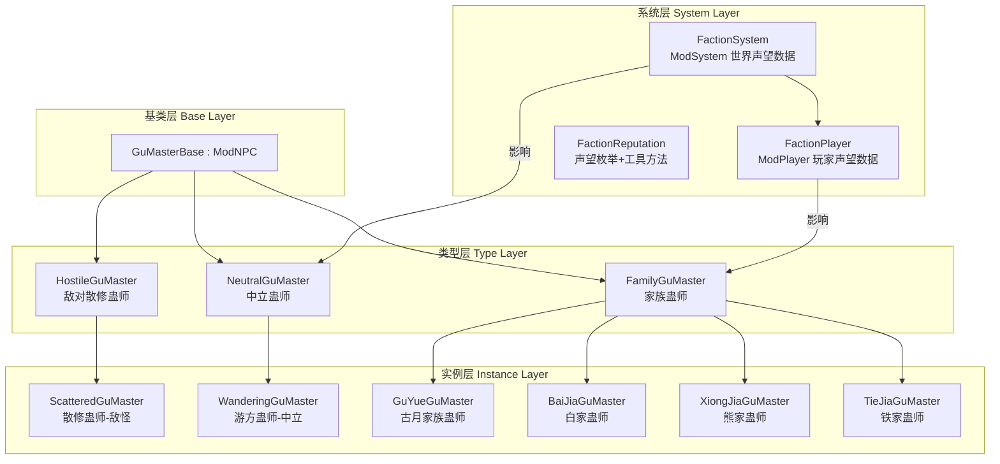
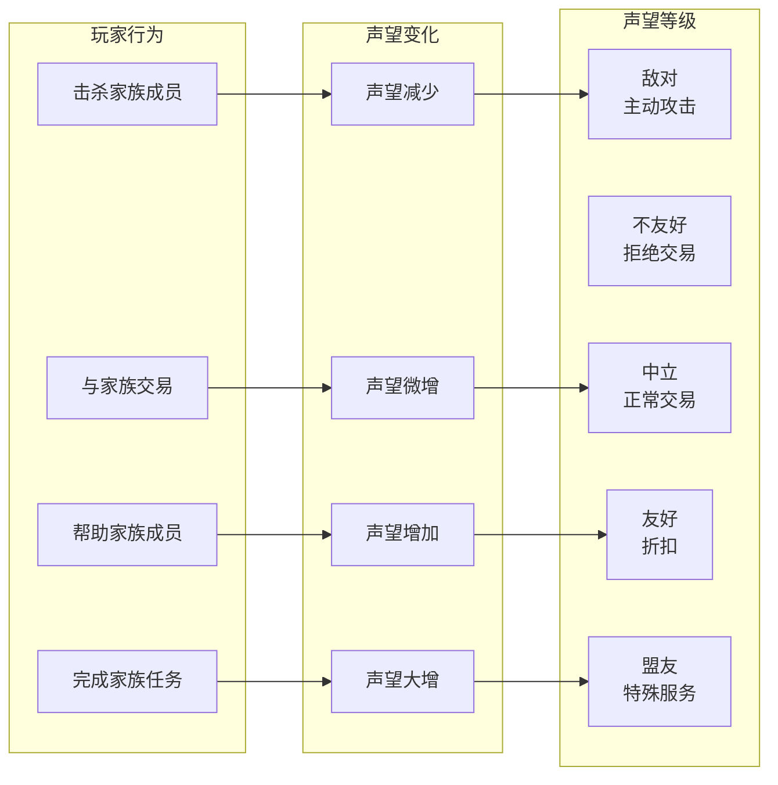

# 蛊师基类 + 家族/势力声望系统 架构方案

## 一、需求分析

根据用户需求：
1. **贴图占位**：复制已有贴图作为新NPC的临时贴图
2. **蛊师原型基类**：可继承出多种蛊师变体
3. **蛊师类型**：纯敌对散修蛊师、中立蛊师、家族蛊师
4. **家族/势力系统**：玩家可选择与某个家族友好或不友好

## 二、现有代码基座分析

### 2.1 现有NPC结构

| 文件 | 类型 | 关键特征 |
|------|------|----------|
| `Content/NPCs/Town/XueTangJiaLao.cs` | 城镇NPC（古月家族） | `[AutoloadHead]`, `NPC.townNPC=true`, `AnimationType=NPCID.Guide`, `NPCShop` |
| `Content/NPCs/Town/YaoTangJiaLao.cs` | 城镇NPC（古月药堂） | 同上模式 |
| `Content/NPCs/Town/YuTangJiaLao.cs` | 城镇NPC（古月） | 同上模式 |
| `Content/NPCs/Town/BaiA.cs` | 城镇NPC（白家） | 同上模式，白家姓名列表 |
| `Content/NPCs/Town/JiasTravelingMerchant.cs` | 旅行商人（贾家） | `AbstractNPCShop`, Pool随机库存, 6PM离开 |
| `Content/NPCs/Enemy/TestNpc.cs` | 敌怪NPC | 自定义AI（状态机：闲逛/追逐/攻击） |
| `Content/NPCs/Enemy/ElectricWolf.cs` | 敌怪NPC | 使用Wolf AI/Animation |
| `Content/NPCs/Enemy/StrongElectricWolf.cs` | 敌怪NPC | 同上，更强版本 |
| `Content/NPCs/Enemy/BladeBloodBatGu.cs` | 敌怪NPC | 使用Bat AI |
| `Content/NPCs/Enemy/LegionAnt.cs` | 敌怪NPC | 使用Fighter AI |

### 2.2 现有系统

| 系统 | 文件 | 功能 |
|------|------|------|
| `QiPlayer` | `Common/Players/QiPlayer.cs` | 玩家真元/修为系统 |
| `WolfSystem` | `Common/Systems/WolfSystem.cs` | 世界级狼潮事件系统 |
| `TravelMerchantSystem` | `Common/Systems/TravelMerchantSystem.cs` | 旅行商人刷新管理 |
| `GuPerkSystem` | `Common/Players/GuPerkSystem.cs` | 蛊修 perk 系统 |

### 2.3 数据库中的家族/势力

| 家族 | 数据库条目 | 现有NPC |
|------|-----------|---------|
| 古月家族 | 古月族长、古月漠北、古月赤城、古月药姬等 | XueTangJiaLao, YaoTangJiaLao, YuTangJiaLao |
| 白家 | 白家族长 | BaiA |
| 熊家 | 熊家族长 | 无 |
| 铁家 | 铁家族长 | 无 |
| 百家 | 百家族长 | 无 |
| 汪家 | 汪家族长 | 无 |
| 赵家 | 赵家族长 | 无 |
| 贾家 | - | JiasTravelingMerchant |

---

## 三、架构设计

### 3.1 整体架构图



### 3.2 GuMasterBase 抽象基类

**文件路径**: `Content/NPCs/GuMasters/GuMasterBase.cs`

```csharp
namespace VerminLordMod.Content.NPCs.GuMasters
{
    // 蛊师修为等级
    public enum GuMasterRank
    {
        Zhuan1_Chu = 1,   // 一转初阶
        Zhuan1_Zhong,      // 一转中阶
        Zhuan1_Gao,        // 一转高阶
        Zhuan1_DianFeng,   // 一转巅峰
        Zhuan2_Chu = 5,    // 二转初阶
        // ... 以此类推
    }

    // 蛊师类型
    public enum GuMasterType
    {
        ScatteredHostile,  // 散修敌对
        Neutral,           // 中立
        Family             // 家族
    }

    public abstract class GuMasterBase : ModNPC
    {
        // === 蛊师属性 ===
        public GuMasterRank MasterRank { get; protected set; }
        public GuMasterType MasterType { get; protected set; }
        public string FamilyName { get; protected set; } // 所属家族（仅家族类型）
        public int QiDamage { get; protected set; }       // 真元附加伤害

        // === 状态机 ===
        protected enum GuMasterAIState
        {
            Idle,       // 闲逛
            Chase,      // 追逐
            Attack,     // 攻击
            Flee,       // 逃跑（中立NPC受伤后）
            Patrol      // 巡逻（家族NPC）
        }
        protected GuMasterAIState aiState = GuMasterAIState.Idle;

        // === 抽象方法：子类必须实现 ===
        public abstract void SetGuMasterDefaults();  // 设置蛊师特有属性
        public abstract void GuMasterAI();           // 自定义AI逻辑
        public abstract void OnGuMasterKill();       // 击杀行为

        // === 虚方法：子类可重写 ===
        public virtual bool CanSpawn() => true;
        public virtual void OnHitPlayerEffect(Player target) { }

        // === 基类实现 ===
        public sealed override void SetDefaults()
        {
            NPC.width = 18;
            NPC.height = 40;
            NPC.aiStyle = -1;  // 使用自定义AI
            NPC.knockBackResist = 0.3f;
            NPC.HitSound = SoundID.NPCHit1;
            NPC.DeathSound = SoundID.NPCDeath1;

            SetGuMasterDefaults();  // 子类设置具体数值

            // 根据修为等级自动计算属性
            ApplyRankStats();
        }

        public sealed override void AI()
        {
            UpdateAIState();
            GuMasterAI();
        }

        private void UpdateAIState()
        {
            Player target = Main.player[NPC.target];
            float dist = Vector2.Distance(NPC.Center, target.Center);

            // 根据距离和类型切换状态
            if (dist > 600f) aiState = GuMasterAIState.Idle;
            else if (dist > 200f) aiState = GuMasterAIState.Chase;
            else aiState = GuMasterAIState.Attack;
        }

        private void ApplyRankStats()
        {
            // 根据修为等级自动调整生命/伤害/防御
            int rank = (int)MasterRank;
            NPC.lifeMax = 50 + rank * 30;
            NPC.damage = 10 + rank * 5;
            NPC.defense = 5 + rank * 3;
        }
    }
}
```

### 3.3 敌对散修蛊师 (HostileGuMaster)

**文件路径**: `Content/NPCs/GuMasters/HostileGuMaster.cs`

```csharp
public abstract class HostileGuMaster : GuMasterBase
{
    public override void SetGuMasterDefaults()
    {
        MasterType = GuMasterType.ScatteredHostile;
        NPC.friendly = false;
        NPC.dontTakeDamageFromHostiles = false;
    }

    // 敌对蛊师总是攻击玩家
    protected override void UpdateAIState()
    {
        Player target = Main.player[NPC.target];
        float dist = Vector2.Distance(NPC.Center, target.Center);
        if (dist > 700f) aiState = GuMasterAIState.Idle;
        else if (dist > 150f) aiState = GuMasterAIState.Chase;
        else aiState = GuMasterAIState.Attack;
    }
}
```

**实例 - 散修敌对蛊师**:
```csharp
public class ScatteredGuMaster : HostileGuMaster
{
    public override void SetGuMasterDefaults()
    {
        MasterRank = GuMasterRank.Zhuan1_Gao;  // 一转高阶
        NPC.lifeMax = 120;
        NPC.damage = 18;
        NPC.defense = 8;
        NPC.value = Item.buyPrice(0, 0, 5, 0);
    }

    public override void GuMasterAI()
    {
        // 使用TestNpc的状态机模式：闲逛/追逐/远程攻击
        // 随机发射月光投射物
    }

    public override float SpawnChance(NPCSpawnInfo spawnInfo)
    {
        // 地表夜晚 + 玩家已开启空窍
        return SpawnCondition.OverworldNightMonster.Chance * 0.05f;
    }
}
```

### 3.4 中立蛊师 (NeutralGuMaster)

**文件路径**: `Content/NPCs/GuMasters/NeutralGuMaster.cs`

```csharp
public abstract class NeutralGuMaster : GuMasterBase
{
    public override void SetGuMasterDefaults()
    {
        MasterType = GuMasterType.Neutral;
        NPC.friendly = true;  // 默认友好
        NPC.townNPC = false;  // 但不是城镇NPC（不占房屋）
    }

    // 中立蛊师：被攻击后反击
    private int aggroTimer = 0;

    public override void OnHitByPlayer(Player player, Player.HurtInfo hurtInfo)
    {
        aggroTimer = 600;  // 10秒敌对
        NPC.friendly = false;
    }

    public override void AI()
    {
        if (aggroTimer > 0)
        {
            aggroTimer--;
            if (aggroTimer == 0) NPC.friendly = true;
        }
        base.AI();
    }
}
```

### 3.5 家族蛊师 (FamilyGuMaster)

**文件路径**: `Content/NPCs/GuMasters/FamilyGuMaster.cs`

```csharp
public abstract class FamilyGuMaster : GuMasterBase
{
    public override void SetGuMasterDefaults()
    {
        MasterType = GuMasterType.Family;
    }

    // 家族蛊师的行为受玩家与该家族声望影响
    public override void AI()
    {
        FactionReputation rep = Main.LocalPlayer.GetModPlayer<FactionPlayer>()
            .GetReputation(FamilyName);

        switch (rep)
        {
            case FactionReputation.Hostile:
                NPC.friendly = false;  // 主动攻击
                break;
            case FactionReputation.Neutral:
                NPC.friendly = true;   // 中立，可交易
                break;
            case FactionReputation.Friendly:
                NPC.friendly = true;   // 友好，折扣
                break;
            case FactionReputation.Allied:
                NPC.friendly = true;   // 盟友，特殊服务
                break;
        }
        base.AI();
    }
}
```

---

## 四、家族/势力声望系统

### 4.1 声望枚举

```csharp
public enum FactionReputation
{
    Hostile = -2,     // 敌对 - 家族NPC主动攻击
    Unfriendly = -1,  // 不友好 - 家族NPC不交易
    Neutral = 0,      // 中立 - 默认状态
    Friendly = 1,     // 友好 - 折扣交易
    Allied = 2        // 盟友 - 特殊服务/任务
}
```

### 4.2 FactionPlayer (ModPlayer)

**文件路径**: `Common/Players/FactionPlayer.cs`

```csharp
public class FactionPlayer : ModPlayer
{
    // 家族声望字典: FamilyName -> Reputation
    public Dictionary<string, FactionReputation> FactionReputations = new();

    // 声望值（数值版，用于渐变）
    public Dictionary<string, int> FactionReputationPoints = new();

    public FactionReputation GetReputation(string familyName)
    {
        if (FactionReputations.TryGetValue(familyName, out var rep))
            return rep;
        return FactionReputation.Neutral;  // 默认中立
    }

    // 增加声望
    public void AddReputation(string familyName, int points)
    {
        if (!FactionReputationPoints.ContainsKey(familyName))
            FactionReputationPoints[familyName] = 0;

        FactionReputationPoints[familyName] += points;
        UpdateReputationLevel(familyName);
    }

    // 减少声望
    public void RemoveReputation(string familyName, int points)
    {
        AddReputation(familyName, -points);
    }

    private void UpdateReputationLevel(string familyName)
    {
        int points = FactionReputationPoints.GetValueOrDefault(familyName, 0);
        if (points <= -100) FactionReputations[familyName] = FactionReputation.Hostile;
        else if (points < 0) FactionReputations[familyName] = FactionReputation.Unfriendly;
        else if (points == 0) FactionReputations[familyName] = FactionReputation.Neutral;
        else if (points < 100) FactionReputations[familyName] = FactionReputation.Friendly;
        else FactionReputations[familyName] = FactionReputation.Allied;
    }

    // 击杀敌对家族成员减少声望
    public void OnKillFamilyMember(string familyName)
    {
        RemoveReputation(familyName, 10);
    }

    // 完成家族任务增加声望
    public void OnCompleteFamilyQuest(string familyName)
    {
        AddReputation(familyName, 30);
    }

    public override void SaveData(TagCompound tag)
    {
        tag["factionRepPoints"] = FactionReputationPoints;
    }

    public override void LoadData(TagCompound tag)
    {
        FactionReputationPoints = tag.Get<Dictionary<string, int>>("factionRepPoints");
        // 重新计算声望等级
        foreach (var key in FactionReputationPoints.Keys)
            UpdateReputationLevel(key);
    }
}
```

### 4.3 FactionSystem (ModSystem)

**文件路径**: `Common/Systems/FactionSystem.cs`

```csharp
public class FactionSystem : ModSystem
{
    // 所有已知家族列表
    public static readonly string[] KnownFamilies = {
        "古月家族", "白家", "熊家", "铁家", "百家", "汪家", "赵家", "贾家"
    };

    // 家族之间的好感度关系（用于NPC之间的互动）
    public static Dictionary<string, Dictionary<string, int>> FamilyRelations = new()
    {
        ["古月家族"] = new() { ["白家"] = 50, ["熊家"] = -20 },
        ["白家"] = new() { ["古月家族"] = 30, ["铁家"] = 10 },
        // ...
    };

    // 获取家族显示名称
    public static string GetFamilyDisplayName(string familyKey)
    {
        return familyKey switch
        {
            "GuYue" => "古月家族",
            "Bai" => "白家",
            "Xiong" => "熊家",
            "Tie" => "铁家",
            "Bai2" => "百家",
            "Wang" => "汪家",
            "Zhao" => "赵家",
            "Jia" => "贾家",
            _ => familyKey
        };
    }
}
```

### 4.4 声望影响流程



---

## 五、具体NPC类型设计

### 5.1 第一阶段：敌对散修蛊师（敌怪）

| NPC | 文件 | 描述 | 修为 | 特征 |
|-----|------|------|------|------|
| `ScatteredGuMaster` | `Content/NPCs/GuMasters/ScatteredGuMaster.cs` | 散修敌对蛊师 | 一转中阶~二转初阶 | 使用TestNpc的AI，远程发射投射物 |
| `StrongScatteredGuMaster` | `Content/NPCs/GuMasters/StrongScatteredGuMaster.cs` | 精英散修敌对蛊师 | 二转中阶~高阶 | 更强，有护盾蛊 |

### 5.2 第二阶段：中立游方蛊师

| NPC | 文件 | 描述 | 特征 |
|-----|------|------|------|
| `WanderingGuMaster` | `Content/NPCs/GuMasters/WanderingGuMaster.cs` | 游方蛊师 | 中立，可交易，被攻击后反击 |

### 5.3 第三阶段：家族蛊师

| NPC | 文件 | 家族 | 类型 |
|-----|------|------|------|
| `GuYuePatrolGuMaster` | `Content/NPCs/GuMasters/GuYuePatrolGuMaster.cs` | 古月家族 | 巡逻敌怪（敌对时）/友好（友好时） |
| `BaiJiaPatrolGuMaster` | `Content/NPCs/GuMasters/BaiJiaPatrolGuMaster.cs` | 白家 | 同上 |
| `XiongJiaGuMaster` | `Content/NPCs/GuMasters/XiongJiaGuMaster.cs` | 熊家 | 同上 |
| `TieJiaGuMaster` | `Content/NPCs/GuMasters/TieJiaGuMaster.cs` | 铁家 | 同上 |

### 5.4 家族城镇NPC扩展

在现有城镇NPC基础上，增加声望影响：

| 现有NPC | 修改内容 |
|---------|---------|
| `XueTangJiaLao` | 声望影响商店价格 |
| `BaiA` | 声望影响商店价格 |
| `YaoTangJiaLao` | 声望影响治疗费用 |
| `JiasTravelingMerchant` | 声望影响库存质量 |

---

## 六、贴图占位方案

### 6.1 复制策略

| 新NPC | 占位贴图来源 |
|-------|-------------|
| `ScatteredGuMaster` | 复制 `TestNpc.png` → `ScatteredGuMaster.png` |
| `StrongScatteredGuMaster` | 复制 `TestNpc.png` → `StrongScatteredGuMaster.png` |
| `WanderingGuMaster` | 复制 `XueTangJiaLao.png` → `WanderingGuMaster.png` |
| `GuYuePatrolGuMaster` | 复制 `XueTangJiaLao.png` → `GuYuePatrolGuMaster.png` |
| `BaiJiaPatrolGuMaster` | 复制 `BaiA.png` → `BaiJiaPatrolGuMaster.png` |

### 6.2 贴图目录结构

```
Content/NPCs/GuMasters/
├── GuMasterBase.cs
├── HostileGuMaster.cs
├── NeutralGuMaster.cs
├── FamilyGuMaster.cs
├── ScatteredGuMaster.cs
├── ScatteredGuMaster.png          (copy of TestNpc.png)
├── StrongScatteredGuMaster.cs
├── StrongScatteredGuMaster.png    (copy of TestNpc.png)
├── WanderingGuMaster.cs
├── WanderingGuMaster.png          (copy of XueTangJiaLao.png)
├── GuYuePatrolGuMaster.cs
├── GuYuePatrolGuMaster.png        (copy of XueTangJiaLao.png)
├── BaiJiaPatrolGuMaster.cs
├── BaiJiaPatrolGuMaster.png       (copy of BaiA.png)
├── XiongJiaGuMaster.cs
├── XiongJiaGuMaster.png           (copy of TestNpc.png)
└── TieJiaGuMaster.cs
└── TieJiaGuMaster.png             (copy of TestNpc.png)
```

---

## 七、实现优先级与分阶段计划

### Phase 1: 基础设施（贴图占位 + 基类）

| 步骤 | 文件 | 说明 |
|------|------|------|
| 1.1 | 复制贴图 | 复制6张占位贴图 |
| 1.2 | `GuMasterBase.cs` | 抽象基类，修为枚举，状态机 |
| 1.3 | `HostileGuMaster.cs` | 敌对蛊师抽象类 |
| 1.4 | `NeutralGuMaster.cs` | 中立蛊师抽象类 |
| 1.5 | `FamilyGuMaster.cs` | 家族蛊师抽象类 |

### Phase 2: 声望系统

| 步骤 | 文件 | 说明 |
|------|------|------|
| 2.1 | `Common/Players/FactionPlayer.cs` | ModPlayer声望数据 |
| 2.2 | `Common/Systems/FactionSystem.cs` | ModSystem家族数据 |
| 2.3 | 本地化 | 声望等级显示文本 |

### Phase 3: 具体NPC实现

| 步骤 | 文件 | 说明 |
|------|------|------|
| 3.1 | `ScatteredGuMaster.cs` | 敌对散修蛊师（敌怪） |
| 3.2 | `StrongScatteredGuMaster.cs` | 精英敌对散修蛊师（敌怪） |
| 3.3 | `WanderingGuMaster.cs` | 中立游方蛊师 |
| 3.4 | `GuYuePatrolGuMaster.cs` | 古月家族巡逻蛊师 |
| 3.5 | `BaiJiaPatrolGuMaster.cs` | 白家巡逻蛊师 |

### Phase 4: 声望与现有NPC集成

| 步骤 | 说明 |
|------|------|
| 4.1 | 修改XueTangJiaLao商店价格受声望影响 |
| 4.2 | 修改BaiA商店价格受声望影响 |
| 4.3 | 修改JiasTravelingMerchant库存受声望影响 |
| 4.4 | 添加声望UI提示（聊天框消息） |

### Phase 5: 扩展家族

| 步骤 | 说明 |
|------|------|
| 5.1 | 添加熊家、铁家、百家等家族NPC |
| 5.2 | 添加家族之间的好感度关系 |
| 5.3 | 添加家族任务系统（可选） |

---

## 八、关键设计决策

### 8.1 为什么使用抽象类而非接口？

- 蛊师NPC共享大量通用逻辑（修为属性计算、状态机、真元系统交互）
- 抽象类可以提供默认实现，子类只需重写特定行为
- 与tModLoader的 `ModNPC` 继承体系一致

### 8.2 为什么家族蛊师不是城镇NPC？

- 家族巡逻蛊师是野外刷新的，不占房屋
- 它们的行为受声望影响（敌对时攻击，友好时中立）
- 真正的家族城镇NPC（如 XueTangJiaLao）保持现有结构，仅增加声望影响

### 8.3 声望系统设计原则

- **简单数值系统**：声望点数 [-∞, +∞]，映射到5个等级
- **持久化**：通过 `ModPlayer.SaveData/LoadData` 保存
- **事件驱动**：击杀家族成员 → 减声望；帮助/交易 → 加声望
- **不影响原版NPC**：仅影响MOD中的家族NPC

### 8.4 与现有系统的兼容性

- `QiPlayer`：蛊师NPC可检测玩家是否开启空窍（`qiEnabled`）作为生成条件
- `WolfSystem`：独立运行，不受影响
- `NPCShop`：现有城镇NPC商店可通过 `ModifyActiveShop` 根据声望调整价格

---

## 九、文件清单

```
新增文件:
├── Content/NPCs/GuMasters/
│   ├── GuMasterBase.cs              (抽象基类)
│   ├── HostileGuMaster.cs           (敌对蛊师抽象类)
│   ├── NeutralGuMaster.cs           (中立蛊师抽象类)
│   ├── FamilyGuMaster.cs            (家族蛊师抽象类)
│   ├── ScatteredGuMaster.cs         (散修敌对蛊师)
│   ├── ScatteredGuMaster.png        (贴图占位)
│   ├── StrongScatteredGuMaster.cs   (精英散修敌对蛊师)
│   ├── StrongScatteredGuMaster.png  (贴图占位)
│   ├── WanderingGuMaster.cs         (游方中立蛊师)
│   ├── WanderingGuMaster.png        (贴图占位)
│   ├── GuYuePatrolGuMaster.cs       (古月巡逻蛊师)
│   ├── GuYuePatrolGuMaster.png      (贴图占位)
│   ├── BaiJiaPatrolGuMaster.cs      (白家巡逻蛊师)
│   └── BaiJiaPatrolGuMaster.png     (贴图占位)
├── Common/Players/FactionPlayer.cs  (玩家声望数据)
└── Common/Systems/FactionSystem.cs  (世界声望系统)

修改文件:
├── Localization/zh-Hans_Mods.VerminLordMod.hjson  (新增NPC名称)
└── Content/NPCs/Town/XueTangJiaLao.cs             (声望影响商店)
```

---

## 十、待确认问题

1. **家族名称体系**：古月家族使用"古月"前缀，白家使用"白"前缀。其他家族（熊、铁、百、汪、赵）是否也需要对应的姓名列表？
2. **声望UI**：是否需要专门的声望界面（如ModConfig或UI面板），还是仅通过聊天框提示？
3. **家族任务**：是否需要在Phase 5实现简单的家族任务系统（如"击杀敌对家族成员"）？
4. **敌对散修蛊师的掉落**：应该掉落什么？元石(YuanS) + 随机低阶蛊虫？
