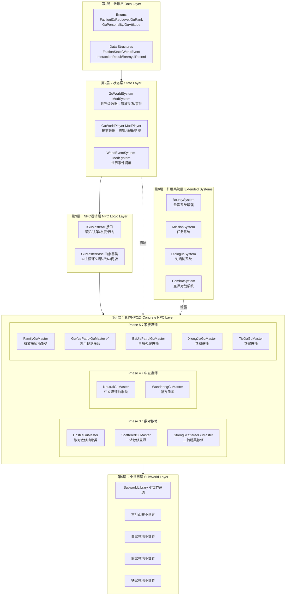
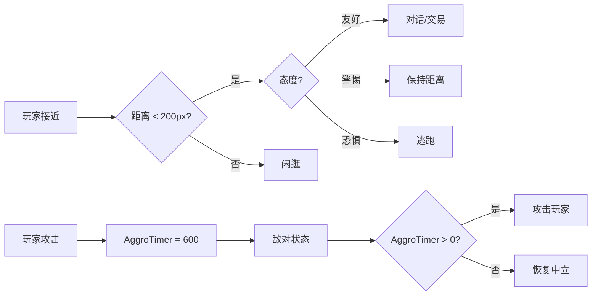
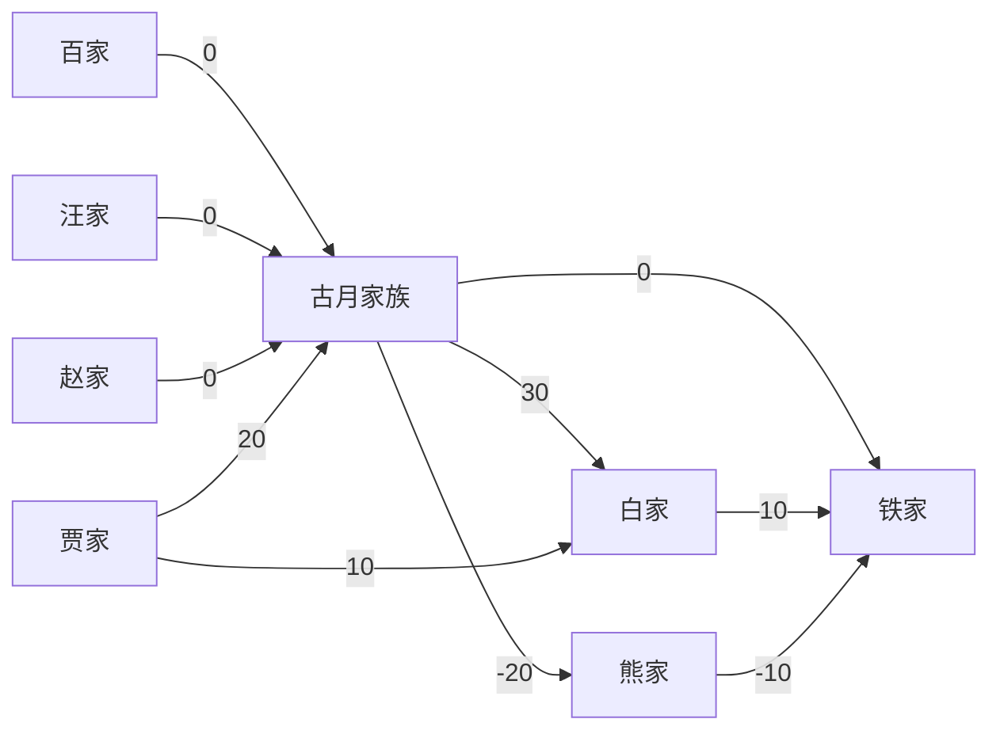
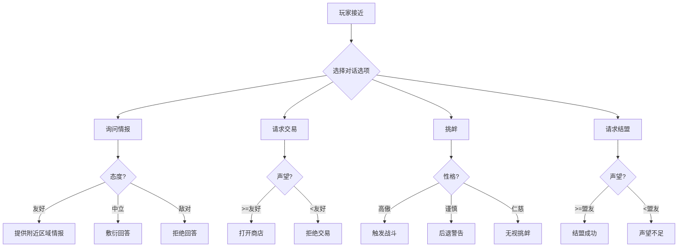

# 蛊师世界整体架构规划

> 基于《蛊真人》小说世界观，在 tModLoader 中构建完整的蛊师世界模拟系统
> 当前版本：v2.0（整合用户扩展需求后的完整规划）

---

## 一、核心愿景

构建一个**动态的蛊师世界模拟系统**，其中：

- 各大家族拥有自己的**地盘（小世界）**，为后续福地系统打下基础
- 玩家与 NPC 既可**对话也可战斗**，由玩家的选择决定
- 玩家可以使用**计谋**，包括背刺、结盟、被追杀等
- 每个蛊师 NPC 拥有**自己的逻辑和判断方式**
- 玩家的行为产生**连锁反应**，影响整个世界的走向

---

## 二、当前已实现内容（基线）

### 2.1 骨架层（Phase 1 - 已完成）

| 文件 | 内容 | 状态 |
|------|------|------|
| [`Common/Systems/GuWorldSystem.cs`](Common/Systems/GuWorldSystem.cs) | 核心枚举 + 数据结构 + 世界级数据持有者 | ✅ 完成 |
| [`Common/Players/GuWorldPlayer.cs`](Common/Players/GuWorldPlayer.cs) | 玩家声望/通缉/结盟/背刺数据 | ✅ 完成 |
| [`Content/NPCs/GuMasters/IGuMasterAI.cs`](Content/NPCs/GuMasters/IGuMasterAI.cs) | 蛊师AI接口 + 态度计算工具 | ✅ 完成 |
| [`Content/NPCs/GuMasters/GuMasterBase.cs`](Content/NPCs/GuMasters/GuMasterBase.cs) | 蛊师抽象基类（感知→态度→决策→行为） | ✅ 完成 |

### 2.2 第一个具体NPC（Phase 2 - 已完成）

| 文件 | 内容 | 状态 |
|------|------|------|
| [`Content/NPCs/GuMasters/GuYuePatrolGuMaster.cs`](Content/NPCs/GuMasters/GuYuePatrolGuMaster.cs) | 古月巡逻蛊师（对话/交易/战斗/巡逻AI） | ✅ 完成 |
| [`Content/NPCs/GuMasters/GuYuePatrolGuMaster.png`](Content/NPCs/GuMasters/GuYuePatrolGuMaster.png) | 占位贴图 | ✅ 完成 |
| [`Content/NPCs/GuMasters/GuYuePatrolGuMaster_Head.png`](Content/NPCs/GuMasters/GuYuePatrolGuMaster_Head.png) | 占位头像 | ✅ 完成 |

### 2.3 世界事件系统（Phase 2 - 已完成）

| 文件 | 内容 | 状态 |
|------|------|------|
| [`Common/Systems/WorldEventSystem.cs`](Common/Systems/WorldEventSystem.cs) | 周期性事件触发（商队/兽潮/集会） | ✅ 完成 |

### 2.4 现有城镇NPC（可集成声望系统）

| NPC | 家族 | 文件 |
|-----|------|------|
| 学堂家老 | 古月家族 | [`Content/NPCs/Town/XueTangJiaLao.cs`](Content/NPCs/Town/XueTangJiaLao.cs) |
| 药堂家老 | 古月家族 | [`Content/NPCs/Town/YaoTangJiaLao.cs`](Content/NPCs/Town/YaoTangJiaLao.cs) |
| 玉堂家老 | 古月家族 | [`Content/NPCs/Town/YuTangJiaLao.cs`](Content/NPCs/Town/YuTangJiaLao.cs) |
| 白家长老 | 白家 | [`Content/NPCs/Town/BaiA.cs`](Content/NPCs/Town/BaiA.cs) |
| 贾家商人 | 贾家 | [`Content/NPCs/Town/JiasTravelingMerchant.cs`](Content/NPCs/Town/JiasTravelingMerchant.cs) |

---

## 三、整体架构图



---

## 四、分阶段实现计划

### Phase 3：敌对散修蛊师（当前阶段）

**目标**：实现纯敌对散修蛊师，作为野外刷新的敌怪NPC

#### 3.1 HostileGuMaster 抽象类

| 项目 | 内容 |
|------|------|
| 文件 | `Content/NPCs/GuMasters/HostileGuMaster.cs` |
| 继承 | `GuMasterBase` |
| 特征 | `NPC.friendly = false`，始终敌对，不对话，掉落战利品 |
| 新增字段 | `DropTable`（掉落表）、`MinSpawnRank`/`MaxSpawnRank`（生成修为范围） |
| 关键方法 | 重写 `SpawnChance()`、`OnKill()`、`ModifyNPCLoot()` |

#### 3.2 ScatteredGuMaster 具体实现

| 项目 | 内容 |
|------|------|
| 文件 | `Content/NPCs/GuMasters/ScatteredGuMaster.cs` |
| 修为 | 一转中阶~一转巅峰（随机） |
| 贴图 | 复制 `GuYuePatrolGuMaster.png` |
| AI | 追逐→近战攻击（使用原版近战逻辑） |
| 掉落 | 元石(50%) + 随机低阶蛊虫材料(20%) |
| 生成 | 夜晚地表，玩家已开启空窍 |

#### 3.3 StrongScatteredGuMaster 精英版

| 项目 | 内容 |
|------|------|
| 文件 | `Content/NPCs/GuMasters/StrongScatteredGuMaster.cs` |
| 修为 | 二转初阶~二转中阶 |
| 贴图 | 复制 `GuYuePatrolGuMaster.png`（可换色） |
| AI | 追逐→远程攻击（发射基础投射物） |
| 掉落 | 元石(80%) + 低阶蛊虫(30%) + 稀有材料(10%) |
| 生成 | 夜晚地表，有概率替代普通散修 |

#### 3.4 数据库事件关联

查询数据库中"散修"相关事件，为散修蛊师添加特殊行为：
- 散修聚集事件（多个散修同时生成）
- 散修争夺宝物事件（散修围绕特定物品）

---

### Phase 4：中立游方蛊师

**目标**：实现中立蛊师，可对话/交易，被攻击后反击

#### 4.1 NeutralGuMaster 抽象类

| 项目 | 内容 |
|------|------|
| 文件 | `Content/NPCs/GuMasters/NeutralGuMaster.cs` |
| 继承 | `GuMasterBase` |
| 特征 | 默认 `friendly = true`，被攻击后 `AggroTimer` 倒计时，计时结束恢复中立 |
| 新增字段 | `AggroDuration`（仇恨持续时间）、`TradeDiscount`（交易折扣） |
| 关键方法 | 重写 `CanChat()`、`ModifyHitByItem()`、`ModifyActiveShop()` |

#### 4.2 WanderingGuMaster 具体实现

| 项目 | 内容 |
|------|------|
| 文件 | `Content/NPCs/GuMasters/WanderingGuMaster.cs` |
| 修为 | 一转高阶~二转初阶 |
| 贴图 | 复制 `XueTangJiaLao.png` |
| AI | 闲逛→接近玩家→对话/交易；被攻击→逃跑或反击 |
| 商店 | 出售随机蛊虫材料、基础蛊虫 |
| 生成 | 白天地表，低概率 |

#### 4.3 中立蛊师行为逻辑



---

### Phase 5：家族蛊师扩展

**目标**：为所有8个家族创建巡逻蛊师，完善家族体系

#### 5.1 FamilyGuMaster 抽象类

| 项目 | 内容 |
|------|------|
| 文件 | `Content/NPCs/GuMasters/FamilyGuMaster.cs` |
| 继承 | `GuMasterBase` |
| 特征 | 行为受玩家与该家族声望影响，可对话/交易/战斗 |
| 新增字段 | `PatrolRadius`（巡逻半径）、`HomeFaction`（所属家族） |
| 关键方法 | 重写 `CalculateAttitude()`（加入声望影响）、`SpawnChance()`（家族领地内概率更高） |

#### 5.2 各家族巡逻蛊师

| NPC | 文件 | 家族 | 修为 | 贴图来源 |
|-----|------|------|------|---------|
| GuYuePatrolGuMaster | ✅ 已完成 | 古月 | 一转高阶 | ✅ 已有 |
| BaiJiaPatrolGuMaster | 新建 | 白家 | 一转高阶 | 复制 BaiA.png |
| XiongJiaGuMaster | 新建 | 熊家 | 二转初阶 | 复制 TestNpc.png |
| TieJiaGuMaster | 新建 | 铁家 | 一转巅峰 | 复制 TestNpc.png |
| Bai2JiaGuMaster | 新建 | 百家 | 一转中阶 | 复制 TestNpc.png |
| WangJiaGuMaster | 新建 | 汪家 | 一转高阶 | 复制 TestNpc.png |
| ZhaoJiaGuMaster | 新建 | 赵家 | 一转巅峰 | 复制 TestNpc.png |

#### 5.3 家族间关系网络

基于小说设定，家族间关系如下：



---

### Phase 6：声望系统与现有NPC集成

**目标**：将声望系统与现有城镇NPC深度集成

#### 6.1 商店价格受声望影响

| NPC | 修改内容 | 影响 |
|-----|---------|------|
| [`XueTangJiaLao.cs`](Content/NPCs/Town/XueTangJiaLao.cs) | `ModifyActiveShop()` 根据声望调整价格 | 友好→8折，敌对→2倍价格 |
| [`BaiA.cs`](Content/NPCs/Town/BaiA.cs) | 同上 | 同上 |
| [`YaoTangJiaLao.cs`](Content/NPCs/Town/YaoTangJiaLao.cs) | 治疗费用受声望影响 | 友好→免费治疗 |
| [`JiasTravelingMerchant.cs`](Content/NPCs/Town/JiasTravelingMerchant.cs) | 库存质量受声望影响 | 友好→稀有物品出现率提升 |

#### 6.2 声望影响对话

| 声望等级 | 对话变化 |
|---------|---------|
| 敌对 | NPC拒绝对话，直接攻击 |
| 不友好 | NPC冷言冷语，不交易 |
| 中立 | 正常对话（当前行为） |
| 友好 | 热情对话，提供情报 |
| 盟友 | 特殊对话，提供任务 |

---

### Phase 7：小世界系统（家族领地）

**目标**：使用 SubworldLibrary 为各家族创建独立小世界

#### 7.1 小世界架构

| 组件 | 文件 | 说明 |
|------|------|------|
| Subworld基类 | [`Common/SubWorlds/Example.cs`](Common/SubWorlds/Example.cs) | 已有示例，参考实现 |
| GuYueTerritory | 新建 | 古月山寨小世界 |
| BaiTerritory | 新建 | 白家领地小世界 |
| XiongTerritory | 新建 | 熊家领地小世界 |
| TieTerritory | 新建 | 铁家领地小世界 |

#### 7.2 小世界入口机制

- 每个家族领地通过特定入口进入（如山洞、传送阵）
- 入口条件：与该家族声望达到特定等级
- 领地内：该家族NPC密度增加，敌对家族NPC不会出现
- 领地核心：家族族长、宝库、任务发布点

#### 7.3 小世界与福地系统的关系

```
小世界（家族领地）→ 基础版独立空间
    ↓ 技术积累
福地（个人洞府）→ 玩家可拥有的私人空间
    ↓ 升级
洞天（高级福地）→ 大型可扩展空间
```

小世界系统为福地系统打下技术基础：
- 子世界生成（GenPass）
- 子世界进入/退出
- 子世界数据持久化
- 子世界内NPC管理

---

### Phase 8：扩展系统

#### 8.1 悬赏系统增强（BountySystem）

| 功能 | 说明 |
|------|------|
| 悬赏发布 | 家族对玩家发布悬赏（已有基础实现） |
| 悬赏领取 | 其他NPC/玩家可领取悬赏任务 |
| 悬赏公示 | 在特定NPC处查看当前悬赏列表 |
| 悬赏奖励 | 击杀被悬赏目标获得元石奖励 |

#### 8.2 任务系统（MissionSystem）

| 任务类型 | 说明 | 奖励 |
|---------|------|------|
| 击杀任务 | 击杀指定敌对家族成员 | 声望+30，元石 |
| 收集任务 | 收集指定材料 | 声望+20，物品 |
| 护送任务 | 护送NPC到指定地点 | 声望+50，稀有物品 |
| 情报任务 | 探索特定区域 | 声望+10，情报 |
| 家族战争 | 参与家族对战 | 声望+100，大量元石 |

#### 8.3 对话树系统（DialogueSystem）

当前对话系统是线性的（一个态度对应一段对话）。增强为对话树：



#### 8.4 蛊师对战系统（CombatSystem）

| 特性 | 说明 |
|------|------|
| NPC vs NPC | 敌对家族NPC之间可互相战斗 |
| 战斗结果 | 胜者存活，败者消失（掉落战利品） |
| 玩家干预 | 玩家可帮助一方，影响声望 |
| 战斗触发 | 家族战争事件、巡逻相遇、领地冲突 |

---

## 五、文件清单（完整）

### 5.1 已存在文件

```
Common/
├── Systems/
│   ├── GuWorldSystem.cs          (核心枚举+数据结构+世界数据)
│   ├── WorldEventSystem.cs       (世界事件调度)
│   └── WolfSystem.cs             (狼潮系统 - 已有)
├── Players/
│   ├── GuWorldPlayer.cs          (玩家声望/通缉/结盟数据)
│   └── QiPlayer.cs               (真元系统 - 已有)
├── SubWorlds/
│   └── Example.cs                (小世界示例 - 已有)
Content/NPCs/GuMasters/
├── IGuMasterAI.cs                (蛊师AI接口)
├── GuMasterBase.cs               (蛊师抽象基类)
├── GuYuePatrolGuMaster.cs        (古月巡逻蛊师)
├── GuYuePatrolGuMaster.png
└── GuYuePatrolGuMaster_Head.png
Content/NPCs/Town/                (5个现有城镇NPC)
```

### 5.2 需新建文件（按阶段）

```
=== Phase 3: 敌对散修 ===
Content/NPCs/GuMasters/
├── HostileGuMaster.cs            (敌对散修抽象类)
├── ScatteredGuMaster.cs          (散修蛊师)
├── ScatteredGuMaster.png
├── StrongScatteredGuMaster.cs    (精英散修)
└── StrongScatteredGuMaster.png

=== Phase 4: 中立蛊师 ===
Content/NPCs/GuMasters/
├── NeutralGuMaster.cs            (中立蛊师抽象类)
├── WanderingGuMaster.cs          (游方蛊师)
└── WanderingGuMaster.png

=== Phase 5: 家族蛊师 ===
Content/NPCs/GuMasters/
├── FamilyGuMaster.cs             (家族蛊师抽象类)
├── BaiJiaPatrolGuMaster.cs       (白家巡逻蛊师)
├── BaiJiaPatrolGuMaster.png
├── XiongJiaGuMaster.cs           (熊家蛊师)
├── XiongJiaGuMaster.png
├── TieJiaGuMaster.cs             (铁家蛊师)
├── TieJiaGuMaster.png
├── Bai2JiaGuMaster.cs            (百家蛊师)
├── Bai2JiaGuMaster.png
├── WangJiaGuMaster.cs            (汪家蛊师)
├── WangJiaGuMaster.png
├── ZhaoJiaGuMaster.cs            (赵家蛊师)
└── ZhaoJiaGuMaster.png

=== Phase 7: 小世界 ===
Common/SubWorlds/
├── GuYueTerritory.cs             (古月山寨小世界)
├── BaiTerritory.cs               (白家领地小世界)
├── XiongTerritory.cs             (熊家领地小世界)
└── TieTerritory.cs               (铁家领地小世界)

=== Phase 8: 扩展系统 ===
Common/Systems/
├── BountySystem.cs               (悬赏系统增强)
├── MissionSystem.cs              (任务系统)
├── DialogueSystem.cs             (对话树系统)
└── CombatSystem.cs               (蛊师对战系统)
```

### 5.3 需修改文件

```
Content/NPCs/Town/
├── XueTangJiaLao.cs              (声望影响商店价格)
├── YaoTangJiaLao.cs              (声望影响治疗费用)
├── BaiA.cs                       (声望影响商店价格)
└── JiasTravelingMerchant.cs      (声望影响库存质量)
Localization/
├── zh-Hans_Mods.VerminLordMod.hjson  (新增NPC本地化)
└── en-US_Mods.VerminLordMod.hjson     (新增NPC本地化)
```

---

## 六、技术关键点

### 6.1 蛊师AI决策流程

```
每 Tick:
  1. Perceive() → 感知环境（距离/生命/时间/附近NPC）
  2. CalculateAttitude() → 计算态度（声望+性格+恶名+修为差）
  3. Decide() → 决策（态度驱动状态切换）
  4. ExecuteAI() → 执行（状态对应的行为逻辑）
```

### 6.2 声望连锁反应

```
玩家击杀古月巡逻蛊师:
  → 古月家族声望 -30
  → 连锁反应：白家（古月盟友）声望 -15
  → 连锁反应：熊家（古月敌对）声望 +15
  → 恶名 +15
  → 如果恶名 > 100：所有家族初始态度下降
```

### 6.3 小世界集成

```
SubworldLibrary 使用流程:
  1. 继承 Subworld 类
  2. 实现 Tasks (List<GenPass>) 生成地形
  3. 实现 OnLoad() 放置NPC/物品
  4. 使用 SubworldSystem.Enter() 进入
  5. 使用 SubworldSystem.Exit() 退出
```

### 6.4 数据持久化

```
GuWorldSystem (ModSystem) → 世界级数据（家族关系/事件）
  ↓ SaveWorldData / LoadWorldData
TagCompound (List<TagCompound> 替代 Dictionary)

GuWorldPlayer (ModPlayer) → 玩家级数据（声望/通缉/结盟）
  ↓ SaveData / LoadData
TagCompound (List<TagCompound> 替代 Dictionary)
```

---

## 七、实现优先级建议

| 优先级 | 阶段 | 内容 | 预估工作量 |
|--------|------|------|-----------|
| P0 | Phase 3 | 敌对散修蛊师（HostileGuMaster + ScatteredGuMaster） | 2个文件 |
| P0 | Phase 3 | 精英散修（StrongScatteredGuMaster） | 1个文件 |
| P1 | Phase 4 | 中立蛊师（NeutralGuMaster + WanderingGuMaster） | 2个文件 |
| P1 | Phase 5 | 家族蛊师抽象类（FamilyGuMaster） | 1个文件 |
| P1 | Phase 5 | 白家/熊家/铁家巡逻蛊师 | 3个文件 |
| P2 | Phase 6 | 声望与现有NPC集成 | 4个文件修改 |
| P2 | Phase 5 | 百家/汪家/赵家巡逻蛊师 | 3个文件 |
| P3 | Phase 7 | 小世界系统（古月山寨） | 1个文件 |
| P3 | Phase 7 | 其他家族小世界 | 3个文件 |
| P4 | Phase 8 | 扩展系统（悬赏/任务/对话树/对战） | 4个文件 |

---

## 八、待讨论问题

1. **小世界入口形式**：传送阵？山洞入口？特定道具触发？
2. **家族族长NPC**：是否需要为每个家族创建独特的族长NPC（如古月族长、白家族长）？
3. **玩家阵营选择**：玩家是否可以加入某个家族？加入后是否影响与其他家族的关系？
4. **多人模式兼容**：声望系统在多人模式下如何同步？
5. **贴图资源**：当前全部使用占位贴图，后续是否需要专业美术资源？
6. **修为系统对接**：蛊师NPC的修为是否应该与玩家的QiPlayer修为系统联动（如高修为玩家低修为NPC自动恐惧）？
7. **福地系统**：小世界系统成熟后，是否开始规划个人福地系统？
