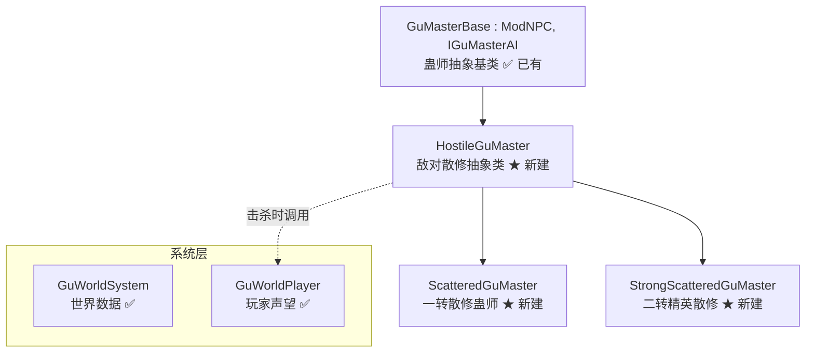

# Phase 3：敌对散修蛊师实现计划

> 基于 [`GuWorld_Overall_Architecture.md`](plans/GuWorld_Overall_Architecture.md) 架构规划
> 当前状态：Phase 1（骨架层）✅ | Phase 2（古月巡逻蛊师+世界事件）✅ | **Phase 3（敌对散修）← 当前**

---

## 一、实现目标

在野外生成纯敌对散修蛊师，作为玩家遭遇的敌怪NPC，丰富世界生态。

| NPC | 修为 | AI类型 | 生成条件 | 掉落 |
|-----|------|--------|---------|------|
| `ScatteredGuMaster`（散修蛊师） | 一转中阶~巅峰 | 近战追逐 | 夜晚地表，玩家已开空窍 | 元石(50%) + 低阶材料(20%) |
| `StrongScatteredGuMaster`（精英散修） | 二转初阶~中阶 | 远程投射物 | 夜晚地表，概率替代普通散修 | 元石(80%) + 低阶蛊虫(30%) + 稀有材料(10%) |

---

## 二、架构设计

### 2.1 类继承关系



### 2.2 HostileGuMaster 抽象类设计

| 项目 | 内容 |
|------|------|
| 文件 | `Content/NPCs/GuMasters/HostileGuMaster.cs` |
| 继承 | `GuMasterBase` |
| 关键特征 | `NPC.friendly = false`，始终敌对，不对话，掉落战利品 |
| 新增字段 | `DropTable`（掉落表）、`MinSpawnRank`/`MaxSpawnRank`（生成修为范围） |
| 重写方法 | `CanChat()` → 返回 `false`（不能对话） |
| | `GetDialogue()` → 返回敌对喊话 |
| | `CalculateAttitude()` → 始终返回 `GuAttitude.Hostile` |
| | `Decide()` → 始终进入 Combat 状态 |
| | `OnKill()` → 调用 `GuWorldPlayer.AddInfamy()` + `RemoveReputation()` |
| | `ModifyNPCLoot()` → 添加掉落表 |

### 2.3 ScatteredGuMaster 具体实现

| 项目 | 内容 |
|------|------|
| 文件 | `Content/NPCs/GuMasters/ScatteredGuMaster.cs` |
| 修为 | 一转中阶~巅峰（随机） |
| 贴图 | 复制 `TestNpc.png` |
| AI | 追逐→近战攻击（使用原版近战逻辑） |
| 掉落 | 元石(50%) + 随机低阶蛊虫材料(20%) |
| 生成 | 夜晚地表，玩家已开启空窍 |

### 2.4 StrongScatteredGuMaster 精英版

| 项目 | 内容 |
|------|------|
| 文件 | `Content/NPCs/GuMasters/StrongScatteredGuMaster.cs` |
| 修为 | 二转初阶~中阶 |
| 贴图 | 复制 `TestNpc.png`（可换色） |
| AI | 追逐→远程攻击（发射基础投射物，参考 `GuYuePatrolGuMaster.ExecuteCombatAI`） |
| 掉落 | 元石(80%) + 低阶蛊虫(30%) + 稀有材料(10%) |
| 生成 | 夜晚地表，有概率替代普通散修 |

---

## 三、文件清单

### 3.1 新建文件（3个C# + 2个贴图）

```
Content/NPCs/GuMasters/
├── HostileGuMaster.cs              (敌对散修抽象类)
├── ScatteredGuMaster.cs            (散修蛊师)
├── ScatteredGuMaster.png           (贴图占位 - 复制TestNpc.png)
├── StrongScatteredGuMaster.cs      (精英散修)
└── StrongScatteredGuMaster.png     (贴图占位 - 复制TestNpc.png)
```

### 3.2 修改文件（2个）

```
Localization/
├── zh-Hans_Mods.VerminLordMod.hjson  (新增NPC名称)
└── en-US_Mods.VerminLordMod.hjson     (新增NPC名称)
```

---

## 四、关键代码设计

### 4.1 HostileGuMaster.cs 核心逻辑

```csharp
public abstract class HostileGuMaster : GuMasterBase
{
    // 敌对散修：始终敌对，不对话
    public override bool CanChat() => false;
    
    public override GuAttitude CalculateAttitude(NPC npc, AttitudeContext context)
        => GuAttitude.Hostile;  // 始终敌对
    
    public override Decision Decide(NPC npc, PerceptionContext context)
    {
        // 始终进入战斗状态
        return new Decision 
        { 
            NewState = GuMasterAIState.Combat, 
            ShouldAttack = true,
            DialogueLine = "找死！" 
        };
    }
    
    public override void OnKill()
    {
        // 击杀散修：恶名+5，散修势力声望-5
        var player = Main.LocalPlayer;
        var worldPlayer = player.GetModPlayer<GuWorldPlayer>();
        worldPlayer.AddInfamy(5);
        worldPlayer.RemoveReputation(FactionID.Scattered, 5, "击杀散修");
    }
}
```

### 4.2 ScatteredGuMaster.cs 核心逻辑

```csharp
[AutoloadHead]  // 不需要头像
public class ScatteredGuMaster : HostileGuMaster
{
    public override FactionID GetFaction() => FactionID.Scattered;
    public override GuRank GetRank() => (GuRank)Main.rand.Next(10, 14); // 一转中阶~巅峰
    public override GuPersonality GetPersonality() => GuPersonality.Aggressive;
    
    // 近战战斗AI
    public override void ExecuteCombatAI(NPC npc)
    {
        // 追逐→近战攻击
        var target = Main.player[npc.target];
        float dist = Vector2.Distance(npc.Center, target.Center);
        
        if (dist > 80f) // 追逐
        {
            float dir = target.Center.X > npc.Center.X ? 1 : -1;
            npc.velocity.X = dir * 2f;
        }
        else // 近战攻击（使用原版碰撞伤害）
        {
            npc.velocity.X *= 0.9f;
        }
        npc.spriteDirection = target.Center.X > npc.Center.X ? 1 : -1;
    }
    
    // 生成条件：夜晚地表，玩家已开空窍
    public override float SpawnChance(NPCSpawnInfo spawnInfo)
    {
        var qiPlayer = spawnInfo.Player.GetModPlayer<QiPlayer>();
        if (!qiPlayer.qiEnabled || Main.dayTime) return 0f;
        return 0.05f;
    }
}
```

### 4.3 StrongScatteredGuMaster.cs 核心逻辑

```csharp
public class StrongScatteredGuMaster : HostileGuMaster
{
    public override FactionID GetFaction() => FactionID.Scattered;
    public override GuRank GetRank() => (GuRank)Main.rand.Next(20, 22); // 二转初阶~中阶
    public override GuPersonality GetPersonality() => GuPersonality.Aggressive;
    
    // 远程战斗AI（参考GuYuePatrolGuMaster）
    public override void ExecuteCombatAI(NPC npc)
    {
        var target = Main.player[npc.target];
        float dist = Vector2.Distance(npc.Center, target.Center);
        
        // 保持距离，远程攻击
        if (dist < 120f) // 太近后退
        {
            float fleeDir = npc.Center.X > target.Center.X ? 1 : -1;
            npc.velocity.X = fleeDir * 2.5f;
        }
        else if (dist > 300f) // 太远靠近
        {
            float dir = target.Center.X > npc.Center.X ? 1 : -1;
            npc.velocity.X = dir * 2f;
        }
        
        // 发射投射物
        if (dist < 400f && Main.rand.NextBool(45))
        {
            Vector2 direction = target.Center - npc.Center;
            direction.Normalize();
            direction *= 6f;
            Projectile.NewProjectile(npc.GetSource_FromAI(), npc.Center, direction,
                ProjectileID.WoodenArrowFriendly, npc.damage / 2, 3f);
        }
    }
    
    // 生成条件：夜晚地表，10%概率替代普通散修
    public override float SpawnChance(NPCSpawnInfo spawnInfo)
    {
        var qiPlayer = spawnInfo.Player.GetModPlayer<QiPlayer>();
        if (!qiPlayer.qiEnabled || Main.dayTime) return 0f;
        return 0.02f; // 比普通散修低概率
    }
}
```

---

## 五、实现步骤

| 步骤 | 文件 | 操作 | 说明 |
|------|------|------|------|
| 1 | `HostileGuMaster.cs` | 新建 | 敌对散修抽象类，继承GuMasterBase，重写态度/决策/击杀逻辑 |
| 2 | `ScatteredGuMaster.cs` | 新建 | 一转散修，近战AI，夜晚地表生成 |
| 3 | `StrongScatteredGuMaster.cs` | 新建 | 二转精英散修，远程AI，概率替代普通散修 |
| 4 | `ScatteredGuMaster.png` | 复制 | 从 `TestNpc.png` 复制 |
| 5 | `StrongScatteredGuMaster.png` | 复制 | 从 `TestNpc.png` 复制 |
| 6 | `zh-Hans_Mods.VerminLordMod.hjson` | 修改 | 添加 `ScatteredGuMaster.DisplayName` 和 `StrongScatteredGuMaster.DisplayName` |
| 7 | `en-US_Mods.VerminLordMod.hjson` | 修改 | 添加英文显示名称 |
| 8 | `GuWorld_Overall_Architecture.md` | 修改 | 标记Phase 3为✅完成 |

---

## 六、与现有系统的交互

### 6.1 声望系统联动

```
击杀散修蛊师:
  → GuWorldPlayer.AddInfamy(5)     → 恶名+5
  → GuWorldPlayer.RemoveReputation(FactionID.Scattered, 5) → 散修声望-5
  → 连锁反应：散修与其他家族关系为0，不影响其他家族声望
```

### 6.2 世界事件联动

```
WorldEventType.GuMasterHunt 触发时:
  → 可增加散修蛊师的生成概率（后续增强）
  → 当前：WorldEventSystem已有事件框架，但散修生成增强待后续实现
```

### 6.3 真元系统联动

```
生成条件检查:
  → QiPlayer.qiEnabled == true 时才生成
  → 确保玩家已开启空窍（成为蛊师）后才遭遇蛊师敌人
```

---

## 七、边界情况处理

| 场景 | 处理方式 |
|------|---------|
| 玩家未开启空窍 | `SpawnChance` 返回0，不生成 |
| 白天 | `SpawnChance` 返回0，不生成 |
| 多人模式 | `Main.LocalPlayer` 获取当前玩家声望，各自独立 |
| 散修击杀散修 | 不影响玩家声望（仅玩家击杀触发） |
| 精英散修替代普通散修 | 通过不同的 `SpawnChance` 概率控制，非互斥 |
