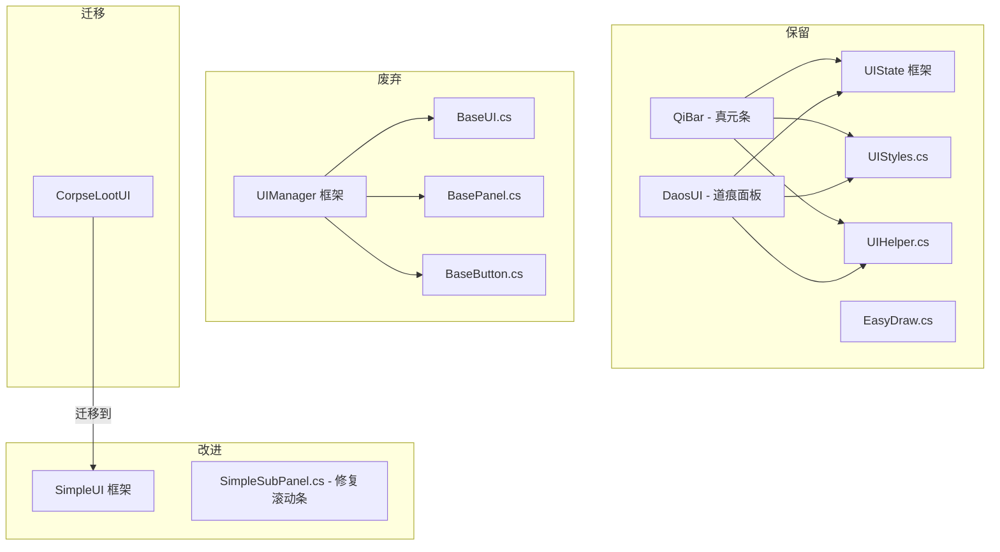

# UI 框架评估报告

## 一、现状概览

项目现有 **三套 UI 框架** 共存：

| 框架 | 路径 | 风格 | 注册方式 | 使用方 |
|------|------|------|---------|--------|
| **UIManager** | [`Common/UI/UIUtils/`](Common/UI/UIUtils/) | 纹理/像素混合，MiroonOS 移植 | `ModSystem.PostDrawInterface` | [`CorpseLootUI`](Common/UI/DeepLootUI.cs) |
| **UIState** (官方) | [`Common/UI/QiUI/`](Common/UI/QiUI/), [`DaosUI/`](Common/UI/DaosUI/) | 现代化扁平轻量，`UIPanel`/`UIText` | `UserInterface` + `ModifyInterfaceLayers` | [`QiBar`](Common/UI/QiUI/QiBar.cs), [`DaosUI`](Common/UI/DaosUI/DaosUI.cs) |
| **SimpleUI** | [`Common/UI/SimpleUI/`](Common/UI/SimpleUI/) | 淡紫色主题，纯像素绘制 | `ModSystem.UpdateUI` + `ModifyInterfaceLayers` | [`SearchChairHandler`](Content/Items/Debuggers/SearchChair/SearchChairHandler.cs) |

## 二、各框架详细分析

### 2.1 UIManager 框架（建议废弃）

**文件清单：**
- [`UIManager.cs`](Common/UI/UIUtils/UIManager.cs) — 管理器（196行）
- [`BaseUI.cs`](Common/UI/UIUtils/BaseUI.cs) — 基础 UI 容器（93行）
- [`BasePanel.cs`](Common/UI/UIUtils/BasePanel.cs) — 面板（195行）
- [`BaseButton.cs`](Common/UI/UIUtils/BaseButton.cs) — 按钮（178行）
- [`EasyDraw.cs`](Common/UI/UIUtils/EasyDraw.cs) — SpriteBatch 辅助（146行）

**特点：**
- 从 MiroonOS_Public 移植，使用 `goto` 语句（`UIManager.cs:121`）
- 基于纹理 + 像素坐标，无弹性布局
- 点击检测使用上升沿检测（`DetectClick`）
- 使用反射操作 `SpriteBatch` 私有字段（`EasyDraw.cs`）

**唯一使用者：** [`CorpseLootUI`](Common/UI/DeepLootUI.cs)（尸体战利品 UI，330行）

**问题：**
1. `goto FoundButton` — 代码风格不推荐
2. 反射操作 `SpriteBatch` 私有字段 — 版本兼容风险
3. 无弹性布局 — 分辨率适配差
4. 仅一个业务 UI 使用 — 维护成本高

### 2.2 UIState 框架（官方，建议保留）

**文件清单：**
- [`UIStyles.cs`](Common/UI/UIUtils/UIStyles.cs) — 统一风格定义（165行）
- [`UIHelper.cs`](Common/UI/UIUtils/UIHelper.cs) — 辅助工具（244行）

**使用者：**
- [`QiBar`](Common/UI/QiUI/QiBar.cs) — 真元条（217行）
- [`DaosUI`](Common/UI/DaosUI/DaosUI.cs) — 道痕面板（120行）

**特点：**
- 使用 tModLoader 官方 `UIState`/`UIPanel`/`UIText` 等
- 通过 `UserInterface` + `ModifyInterfaceLayers` 注册
- 现代化扁平风格（深色主题）
- `UIStyles` 和 `UIHelper` 是纯工具类，无框架依赖

**优势：**
- 官方支持，稳定可靠
- 弹性布局（`Left`/`Top` 支持百分比）
- 事件系统完善（`OnLeftClick` 等）

### 2.3 SimpleUI 框架（建议保留并改进）

**文件清单：**
- [`SimpleUISystem.cs`](Common/UI/SimpleUI/SimpleUISystem.cs) — 管理器（379行）
- [`SimplePanel.cs`](Common/UI/SimpleUI/SimplePanel.cs) — 主面板（662行）
- [`SimpleSubPanel.cs`](Common/UI/SimpleUI/SimpleSubPanel.cs) — 嵌套子面板（918行）
- [`SimpleInfoBox.cs`](Common/UI/SimpleUI/SimpleInfoBox.cs) — 信息提示框（367行）
- [`SimpleLightBox.cs`](Common/UI/SimpleUI/SimpleLightBox.cs) — 轻量信息框（320行）
- [`SimpleButton.cs`](Common/UI/SimpleUI/SimpleButton.cs) — 按钮（227行）
- [`SimpleItemSlot.cs`](Common/UI/SimpleUI/SimpleItemSlot.cs) — 物品格子（278行）
- [`SimpleFixedGroup.cs`](Common/UI/SimpleUI/SimpleFixedGroup.cs) — 固定框（229行）
- [`SimpleAnimSlotRow.cs`](Common/UI/SimpleUI/SimpleAnimSlotRow.cs) — 动画格子行（354行）

**使用者：**
- [`SearchChairHandler`](Content/Items/Debuggers/SearchChair/SearchChairHandler.cs) — 搜索椅 UI（300行）

**特点：**
- 纯像素绘制，无纹理依赖
- 淡紫色主题，统一视觉风格
- 弹性定位（百分比 + 像素混合）
- 打开/关闭动画（缩放 + 透明度）
- 支持拖动、调整大小、滚动条
- 支持 ScissorTest 裁剪

**优势：**
- 代码质量高，风格统一
- 功能丰富（动画、滚动、拖动、物品格子）
- 无外部依赖
- 扩展性好（`SubPanelElementType` 枚举支持多种元素类型）

## 三、滚动条问题分析

用户反馈 SimpleUI 的滚动条逻辑有问题。经过代码审查，发现以下潜在问题：

### 3.1 滚动条滑块尺寸计算

在 [`SimpleSubPanel.cs:822-823`](Common/UI/SimpleUI/SimpleSubPanel.cs:822)：
```csharp
float thumbHeight = Math.Max(ScrollbarSize, track.Height * (viewH / contentH));
```

当 `contentH`（虚拟内容高度）远大于 `viewH`（可视区域高度）时，滑块会变得非常小（接近 `ScrollbarSize=10px`），拖动困难。

### 3.2 虚拟内容尺寸的"2倍"规则

在 [`SimpleSubPanel.cs:375-384`](Common/UI/SimpleUI/SimpleSubPanel.cs:375)：
```csharp
if (maxRight > contentRect.Width)
{
    int minVirtualW = contentRect.Width * 2;
    if (maxRight < minVirtualW) maxRight = minVirtualW;
}
```

当内容刚好超出可视区域时，虚拟尺寸被强制设为可视区域的 2 倍，导致滚动条滑块突然变小，用户体验突兀。

### 3.3 滚动条轨道与内容区域的坐标基准不一致

`GetVScrollTrackRect` 使用 `subRect`（子面板矩形）计算轨道位置，而 `GetContentRect` 使用不同的内边距计算。当标题栏存在时，轨道顶部偏移与内容区域顶部偏移可能不一致。

### 3.4 鼠标滚轮滚动无惯性

滚轮滚动直接修改 `_scrollY`，无动画过渡，手感生硬。

## 四、评估结论与建议

### 建议：废弃 UIManager，统一使用 SimpleUI + UIState

| 框架 | 建议 | 理由 |
|------|------|------|
| **UIManager** | ❌ 废弃 | 仅 1 个使用者，代码风格差，反射风险 |
| **UIState** | ✅ 保留 | 官方框架，用于 HUD 类 UI（QiBar、DaosUI） |
| **SimpleUI** | ✅ 保留并改进 | 功能丰富，代码质量高，适合面板类 UI |

### 迁移计划

#### 步骤 1：修复 SimpleUI 滚动条问题
1. 移除虚拟内容尺寸的"2倍"规则（`SimpleSubPanel.cs:375-384`）
2. 滑块最小尺寸设为 `max(ScrollbarSize, track.Height * 0.15)` 而非 `max(ScrollbarSize, track.Height * (viewH / contentH))`
3. 统一轨道与内容区域的坐标基准
4. 为滚轮滚动添加惯性动画

#### 步骤 2：将 CorpseLootUI 从 UIManager 迁移到 SimpleUI
- 使用 `SimplePanel` + `SimpleSubPanel` + `SimpleItemSlot` 重构
- 保留现有功能（跟随尸体位置、全部拾取、单个拾取）
- 删除 `UIManager.cs`、`BaseUI.cs`、`BasePanel.cs`、`BaseButton.cs`
- 保留 `EasyDraw.cs`（EffectsPlayer 的旋风特效绘制依赖它）

#### 步骤 3：保留 UIState 框架不动
- `UIStyles.cs` 和 `UIHelper.cs` 是纯工具类，无框架依赖
- `QiBar` 和 `DaosUI` 运行正常，无需改动

### 文件变更清单

| 操作 | 文件 | 说明 |
|------|------|------|
| 🛠 修复 | [`SimpleSubPanel.cs`](Common/UI/SimpleUI/SimpleSubPanel.cs) | 滚动条滑块尺寸、2倍规则、坐标基准、滚轮惯性 |
| 🔄 迁移 | [`DeepLootUI.cs`](Common/UI/DeepLootUI.cs) | 从 UIManager 迁移到 SimpleUI |
| ❌ 删除 | [`UIManager.cs`](Common/UI/UIUtils/UIManager.cs) | 废弃 |
| ❌ 删除 | [`BaseUI.cs`](Common/UI/UIUtils/BaseUI.cs) | 废弃 |
| ❌ 删除 | [`BasePanel.cs`](Common/UI/UIUtils/BasePanel.cs) | 废弃 |
| ❌ 删除 | [`BaseButton.cs`](Common/UI/UIUtils/BaseButton.cs) | 废弃 |
| ✅ 保留 | [`EasyDraw.cs`](Common/UI/UIUtils/EasyDraw.cs) | EffectsPlayer 依赖 |
| ✅ 保留 | [`UIStyles.cs`](Common/UI/UIUtils/UIStyles.cs) | 纯工具类 |
| ✅ 保留 | [`UIHelper.cs`](Common/UI/UIUtils/UIHelper.cs) | 纯工具类 |
| ✅ 保留 | [`QiBar.cs`](Common/UI/QiUI/QiBar.cs) | 正常运行 |
| ✅ 保留 | [`DaosUI.cs`](Common/UI/DaosUI/DaosUI.cs) | 正常运行 |

### 架构图



## 五、Todo 清单

- [ ] 修复 SimpleSubPanel.cs 滚动条问题（滑块尺寸、2倍规则、坐标基准、滚轮惯性）
- [ ] 将 CorpseLootUI 从 UIManager 迁移到 SimpleUI
- [ ] 删除 UIManager.cs、BaseUI.cs、BasePanel.cs、BaseButton.cs
- [ ] 保留 EasyDraw.cs（EffectsPlayer 依赖）
- [ ] 保留 UIStyles.cs 和 UIHelper.cs（纯工具类，QiBar/DaosUI 依赖）
- [ ] 编译验证
