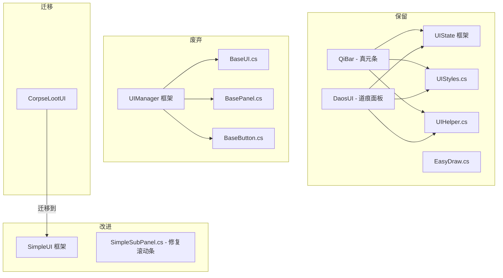

# UI 框架统一迁移计划

## 目标

废弃 UIManager 旧框架，将 [`CorpseLootUI`](Common/UI/DeepLootUI.cs) 迁移到 SimpleUI，修复 SimpleUI 滚动条问题，保留 UIState 框架不动。

## 架构图



## 步骤 1：修复 SimpleSubPanel.cs 滚动条问题

### 1.1 移除虚拟内容尺寸的"2倍"规则

**文件：** [`SimpleSubPanel.cs`](Common/UI/SimpleUI/SimpleSubPanel.cs)
**位置：** 第 372-384 行

**问题：** 当内容刚好超出可视区域时，虚拟尺寸被强制设为可视区域的 2 倍，导致滚动条滑块突然变小。

**修改：** 移除 `if (maxRight > contentRect.Width)` 和 `if (maxBottom > contentRect.Height)` 中的 2 倍规则，改为直接使用实际内容尺寸 + 余量。

```csharp
// 修改前
if (maxRight > contentRect.Width)
{
    int minVirtualW = contentRect.Width * 2;
    if (maxRight < minVirtualW) maxRight = minVirtualW;
}

// 修改后
// 直接使用实际内容尺寸，不再强制 2 倍
// 余量已通过 ScrollMargin 添加
```

### 1.2 优化滑块最小尺寸计算

**位置：** 第 822 行

**问题：** `thumbHeight = Math.Max(ScrollbarSize, track.Height * (viewH / contentH))` 在内容远大于可视区域时，滑块会变得极小（接近 10px）。

**修改：** 设置最小滑块比例为轨道高度的 15%。

```csharp
// 修改前
float thumbHeight = Math.Max(ScrollbarSize, track.Height * (viewH / contentH));

// 修改后
float thumbHeight = Math.Max(ScrollbarSize, Math.Max(track.Height * 0.15f, track.Height * (viewH / contentH)));
```

### 1.3 统一滚动条轨道与内容区域的坐标基准

**位置：** 第 800-813 行（`GetVScrollTrackRect`）

**问题：** `GetVScrollTrackRect` 使用 `subRect` 计算轨道位置，而 `GetContentRect` 使用不同的内边距计算。当标题栏存在时，轨道顶部偏移与内容区域顶部偏移可能不一致。

**修改：** 让 `GetVScrollTrackRect` 直接基于 `contentRect` 计算，确保轨道与内容区域对齐。

```csharp
// 修改前
private Rectangle GetVScrollTrackRect(Rectangle subRect, Rectangle contentRect)
{
    int top = subRect.Y + BorderWidth;
    if (!string.IsNullOrEmpty(Title))
        top += TitleHeight;
    top += Padding;
    int bottom = subRect.Bottom - BorderWidth - Padding;
    bottom -= ScrollbarSize;
    int trackX = subRect.Right - BorderWidth - ScrollbarSize;
    return new Rectangle(trackX, top, ScrollbarSize, Math.Max(1, bottom - top));
}

// 修改后
private Rectangle GetVScrollTrackRect(Rectangle subRect, Rectangle contentRect)
{
    // 直接使用 contentRect 的 Y 和 Height，确保与内容区域对齐
    int top = contentRect.Y;
    int bottom = contentRect.Bottom;
    // 如果有水平滚动条，留出空间
    bottom -= ScrollbarSize;
    int trackX = subRect.Right - BorderWidth - ScrollbarSize;
    return new Rectangle(trackX, top, ScrollbarSize, Math.Max(1, bottom - top));
}
```

### 1.4 为鼠标滚轮滚动添加惯性动画

**位置：** 第 412-430 行

**问题：** 滚轮滚动直接修改 `_scrollY`，无动画过渡，手感生硬。

**修改：** 引入目标滚动值和惯性动画系统。

```csharp
// 新增字段
private float _targetScrollY;
private float _targetScrollX;
private float _scrollVelocityY;
private float _scrollVelocityX;
private const float ScrollInertia = 0.85f;  // 惯性系数
private const float ScrollFriction = 0.1f;  // 摩擦系数

// 修改滚轮处理
int delta = _lastScrollValue - currentScroll;
if (delta != 0)
{
    if (needVScroll)
        _targetScrollY += delta * 0.3f;
    else if (needHScroll)
        _targetScrollX += delta * 0.3f;
}

// 应用惯性动画
_scrollY += (_targetScrollY - _scrollY) * ScrollFriction;
_scrollX += (_targetScrollX - _scrollX) * ScrollFriction;
_targetScrollY *= ScrollInertia;
_targetScrollX *= ScrollInertia;

// 当目标值接近当前值时，直接对齐
if (Math.Abs(_targetScrollY - _scrollY) < 0.5f)
{
    _scrollY = _targetScrollY;
    _targetScrollY = 0;
}
```

## 步骤 2：将 CorpseLootUI 从 UIManager 迁移到 SimpleUI

### 2.1 功能需求分析

[`CorpseLootUI`](Common/UI/DeepLootUI.cs) 当前功能：
- 显示在尸体上方，跟随尸体位置
- 显示尸体中的物品列表（格子布局，每行最多 6 个）
- "全部拾取"按钮
- 单个物品点击拾取
- 悬停显示物品名称
- 面板限制在屏幕范围内

### 2.2 重构方案

由于 CorpseLootUI 是一个**跟随尸体位置的浮动 UI**，不适合直接使用 SimplePanel（可拖动、可调整大小的面板）。更好的方案是：

**方案：** 保持 CorpseLootUI 的独立绘制逻辑，但移除对 UIManager/BaseUI/BasePanel 的依赖，改为直接使用 SimpleUI 的绘制工具方法（如 SimpleButton 的样式、SimpleItemSlot 的物品绘制），并通过 `SimpleUISystem` 的绘制层注册。

**具体设计：**

1. **移除** `_baseUI`、`_mainPanel` 字段和对 `UIManager` 的依赖
2. **改为** 通过 `SimpleUISystem` 的 `ModifyInterfaceLayers` 注册绘制
3. **复用** `SimpleItemSlot` 的物品绘制逻辑
4. **保留** 现有的位置计算、点击检测逻辑
5. **保持** 与 `LootSystem` 的接口不变

### 2.3 接口变更

```csharp
// CorpseLootUI 不再需要 Initialize() 方法
// 改为在 SimpleUISystem 中注册绘制层

// LootSystem 中的调用保持不变
CorpseLootUI.Instance.Open(corpse);
CorpseLootUI.Instance.Close();
```

## 步骤 3：清理废弃的 UIManager 框架文件

| 操作 | 文件 | 说明 |
|------|------|------|
| ❌ 删除 | [`UIManager.cs`](Common/UI/UIUtils/UIManager.cs) | 废弃 |
| ❌ 删除 | [`BaseUI.cs`](Common/UI/UIUtils/BaseUI.cs) | 废弃 |
| ❌ 删除 | [`BasePanel.cs`](Common/UI/UIUtils/BasePanel.cs) | 废弃 |
| ❌ 删除 | [`BaseButton.cs`](Common/UI/UIUtils/BaseButton.cs) | 废弃 |
| ✅ 保留 | [`EasyDraw.cs`](Common/UI/UIUtils/EasyDraw.cs) | EffectsPlayer 依赖 |

## 步骤 4：编译验证与测试

1. 编译项目，修复所有编译错误
2. 验证 SimpleUI 滚动条功能正常（滑块尺寸合理、拖动顺畅、滚轮有惯性）
3. 验证 CorpseLootUI 功能正常（打开/关闭、全部拾取、单个拾取、跟随尸体位置）
4. 验证 QiBar 和 DaosUI 不受影响

## 文件变更清单

| 操作 | 文件 | 说明 |
|------|------|------|
| 🛠 修复 | [`SimpleSubPanel.cs`](Common/UI/SimpleUI/SimpleSubPanel.cs) | 滚动条滑块尺寸、2倍规则、坐标基准、滚轮惯性 |
| 🔄 重构 | [`DeepLootUI.cs`](Common/UI/DeepLootUI.cs) | 从 UIManager 迁移到独立绘制 + SimpleUISystem 注册 |
| ❌ 删除 | [`UIManager.cs`](Common/UI/UIUtils/UIManager.cs) | 废弃 |
| ❌ 删除 | [`BaseUI.cs`](Common/UI/UIUtils/BaseUI.cs) | 废弃 |
| ❌ 删除 | [`BasePanel.cs`](Common/UI/UIUtils/BasePanel.cs) | 废弃 |
| ❌ 删除 | [`BaseButton.cs`](Common/UI/UIUtils/BaseButton.cs) | 废弃 |
| ✅ 保留 | [`EasyDraw.cs`](Common/UI/UIUtils/EasyDraw.cs) | EffectsPlayer 依赖 |
| ✅ 保留 | [`UIStyles.cs`](Common/UI/UIUtils/UIStyles.cs) | 纯工具类 |
| ✅ 保留 | [`UIHelper.cs`](Common/UI/UIUtils/UIHelper.cs) | 纯工具类 |
| ✅ 保留 | [`QiBar.cs`](Common/UI/QiUI/QiBar.cs) | 正常运行 |
| ✅ 保留 | [`DaosUI.cs`](Common/UI/DaosUI/DaosUI.cs) | 正常运行 |
