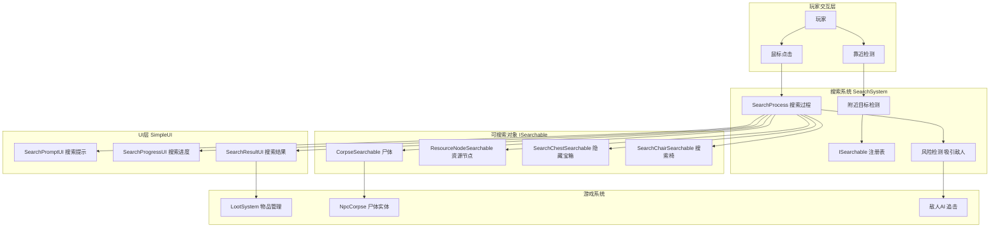

# 搜打撤（Search-Fight-Retreat）搜索系统设计方案

## 一、现状分析

### 1.1 现有搜索椅（SearchChair）—— 调试原型

| 文件 | 职责 | 状态 |
|------|------|------|
| [`SearchChairHandler.cs`](Content/Items/Debuggers/SearchChair/SearchChairHandler.cs) | 搜索椅 UI 管理器 | 纯 UI 原型，无实际搜索逻辑 |
| [`SearchChairTile.cs`](Content/Tiles/Furniture/SearchChairTile.cs) | 搜索椅 Tile，鼠标悬停触发 | 仅触发 UI 显示 |
| [`SearchChairItem.cs`]（未读） | 调试用物品 | 仅用于放置 Tile |

**问题**：
- 搜索椅只是一个调试工具，点击"搜索"按钮后播放动画（`SimpleAnimSlotRow`），**没有任何实际搜索结果**
- 搜索状态机（`NotStarted → Searching → Complete`）是空的，`Complete` 后无任何奖励
- 没有与任何游戏系统（掉落、资源、NPC）关联

### 1.2 现有搜尸体系统（Corpse Looting）—— 功能完整但独立

| 文件 | 职责 | 状态 |
|------|------|------|
| [`NpcCorpse.cs`](Common/Entities/NpcCorpse.cs) | 尸体实体（ModProjectile） | 功能完整 |
| [`LootSystem.cs`](Common/Systems/LootSystem.cs) | 搜尸/掠夺系统 | 功能完整 |
| [`CorpseLootUI.cs`](Common/UI/DeepLootUI.cs) | 尸体战利品 UI | 已迁移到 SimpleUI |
| [`GlobalNPCCorpseHandler.cs`](Common/GlobalNPCs/GlobalNPCCorpseHandler.cs) | NPC 死亡生成尸体 | 功能完整 |
| [`NpcDeathHandler.cs`](Common/Systems/NpcDeathHandler.cs) | 玩家死亡处理 + NPC 搜尸 | 功能完整 |

**尸体系统现状**：
- NPC 死亡 → 30%（Boss 50%）掉落存入尸体
- 玩家靠近（80px）→ 显示"点击搜索"提示
- 右键点击 → 打开格子 UI，显示物品列表
- 支持逐个拾取和全部拾取
- 5 分钟腐烂，到期散落
- NPC 也会搜尸（掠夺型 NPC 搜走 50%）

### 1.3 问题总结

1. **搜索椅是空壳**：有 UI 动画但无实际搜索产出
2. **搜索椅和搜尸体是两套独立系统**：没有统一的"搜索"概念
3. **缺乏"搜打撤"游戏循环**：搜索 → 战斗 → 撤退的闭环未形成
4. **没有搜索技能/风险/奖励机制**：搜索就是简单的右键点击，没有深度

---

## 二、"搜打撤"搜索系统设计

### 2.1 核心概念

**搜打撤**（Search-Fight-Retreat）是一种游戏循环：

```
探索世界 → 发现可搜索目标 → 执行搜索（耗时/风险）→ 获得奖励
    ↑                                                      |
    └────────── 撤退/休整 ←─── 战斗（被搜索吸引的敌人） ←──┘
```

### 2.2 可搜索目标（Searchable Objects）

统一所有可搜索对象，定义接口：

```csharp
public interface ISearchable
{
    /// <summary> 搜索目标名称（显示用） </summary>
    string SearchLabel { get; }
    
    /// <summary> 搜索目标的世界坐标 </summary>
    Vector2 WorldPosition { get; }
    
    /// <summary> 搜索难度（1-10，影响搜索时间和成功率） </summary>
    int SearchDifficulty { get; }
    
    /// <summary> 搜索范围（玩家多近可以搜索） </summary>
    float SearchRange { get; }
    
    /// <summary> 执行搜索，返回搜索结果 </summary>
    SearchResult ExecuteSearch(Player player);
    
    /// <summary> 搜索是否已完成/已耗尽 </summary>
    bool IsExhausted { get; }
    
    /// <summary> 搜索是否可见（玩家靠近时是否显示提示） </summary>
    bool IsVisible { get; }
}
```

**初始可搜索目标类型**：

| 类型 | 来源 | 搜索产出 | 难度 | 可否重复 |
|------|------|----------|------|----------|
| 🧟 怪物尸体 | NPC 死亡 | 元石、材料、灵魂 | 1-3 | 一次 |
| 👤 玩家尸体 | 玩家死亡 | 玩家背包物品 | 2-4 | 一次 |
| 🪨 资源节点 | 地图生成 | 矿石、草药、木材 | 1-5 | 可重复（刷新） |
| 📦 隐藏宝箱 | 地图生成 | 稀有物品、装备 | 3-7 | 一次 |
| 🏚️ 废弃营地 | 地图生成 | 杂物、线索、任务物品 | 2-6 | 一次 |
| 🐾 怪物巢穴 | 怪物行为 | 怪物材料、卵、幼体 | 4-8 | 可重复（刷新） |

### 2.3 搜索流程

```
玩家靠近目标（SearchRange 内）
    │
    ▼
显示"搜索"提示（SimpleLightBox 或世界空间提示）
    │
    ├── 玩家点击搜索 ──→ 进入搜索过程
    │                       │
    │                       ▼
    │               搜索过程（SearchProcess）
    │               ├── 显示搜索进度条/动画（SimpleAnimSlotRow）
    │               ├── 搜索耗时 = 基础时间 × 难度系数
    │               ├── 搜索成功率 = 玩家技能 × 目标难度
    │               ├── 搜索期间可能吸引敌人（"搜"引来"打"）
    │               └── 玩家移动/受伤/远离 → 搜索被打断
    │                       │
    │                       ▼
    │               搜索完成
    │               ├── 成功 → 显示搜索结果（格子 UI / 战利品列表）
    │               │        ├── 逐个拾取
    │               │        └── 全部拾取
    │               └── 失败 → 显示"一无所获"提示
    │                        └── 可能触发负面效果（陷阱、警报）
    │
    └── 玩家离开 → 隐藏提示
```

### 2.4 搜索风险机制（"搜"引来"打"）

搜索不是安全的——这是"搜打撤"的核心：

| 风险类型 | 触发条件 | 效果 |
|----------|----------|------|
| 🗡️ 吸引敌人 | 搜索过程中，每帧概率检测 | 附近敌人被吸引过来 |
| ⚠️ 陷阱触发 | 搜索失败时概率触发 | 玩家受伤/中毒/减速 |
| 📢 警报触发 | 搜索失败时概率触发 | 更大范围的敌人被惊动 |
| 💀 过度搜刮 | 同一区域连续搜索多次 | 敌人刷新率上升 |

**吸引敌人机制**：
```
搜索开始 → 每帧检测附近敌人
    │
    ├── 敌人距离 < 搜索范围 × 3 → 敌人获得玩家位置
    │    └── 敌人 AI 切换为"追击搜索者"
    │
    └── 搜索完成 → 停止吸引
         └── 如果敌人已到达 → 进入战斗
```

### 2.5 搜索技能系统

玩家可以通过以下方式提升搜索能力：

| 技能维度 | 影响 | 提升方式 |
|----------|------|----------|
| 🔍 搜索速度 | 减少搜索耗时 | 搜索次数累积、装备加成 |
| 🎯 搜索精度 | 提高成功率、发现稀有物品概率 | 搜索次数累积、特定道具 |
| 🛡️ 搜索警觉 | 降低被偷袭概率、提前发现敌人 | 特定道具、修为等级 |
| 🧠 搜索知识 | 解锁特殊搜索目标、发现隐藏内容 | 任务奖励、书籍阅读 |

### 2.6 搜索结果（SearchResult）

```csharp
public class SearchResult
{
    /// <summary> 是否成功 </summary>
    public bool Success { get; set; }
    
    /// <summary> 获得的物品列表 </summary>
    public List<Item> Loot { get; set; } = new();
    
    /// <summary> 发现的线索/信息 </summary>
    public string Discovery { get; set; }
    
    /// <summary> 是否触发了陷阱 </summary>
    public bool TriggeredTrap { get; set; }
    
    /// <summary> 是否吸引了敌人 </summary>
    public bool AttractedEnemies { get; set; }
    
    /// <summary> 吸引的敌人列表 </summary>
    public List<int> AttractedNPCWhoAmI { get; set; } = new();
}
```

---

## 三、架构设计

### 3.1 新增文件清单

```
Common/
├── Systems/
│   └── SearchSystem.cs              # 搜索系统（ModSystem，核心管理器）
├── Search/
│   ├── ISearchable.cs               # 可搜索对象接口
│   ├── SearchResult.cs              # 搜索结果数据结构
│   ├── SearchProcess.cs             # 搜索过程（进度/计时/风险）
│   ├── SearchSkill.cs               # 玩家搜索技能组件
│   └── Searchables/
│       ├── CorpseSearchable.cs      # 尸体搜索适配器（包装 NpcCorpse）
│       ├── ResourceNodeSearchable.cs # 资源节点搜索适配器
│       └── SearchChairSearchable.cs  # 搜索椅搜索适配器（替换旧逻辑）
├── UI/
│   └── SearchUI/
│       ├── SearchPromptUI.cs        # 搜索提示 UI（靠近时显示）
│       ├── SearchProgressUI.cs      # 搜索进度 UI（搜索中显示）
│       └── SearchResultUI.cs        # 搜索结果 UI（完成后显示）
└── Players/
    └── SearchPlayer.cs              # 玩家搜索数据（ModPlayer）
```

### 3.2 核心类职责

#### [`SearchSystem.cs`](Common/Systems/SearchSystem.cs) — 搜索系统（ModSystem）

```
职责：
├── 管理所有 ISearchable 实例的注册/注销
├── 每帧检测玩家附近的可搜索目标
├── 管理搜索过程（SearchProcess）的生命周期
├── 处理搜索吸引敌人的逻辑
├── 提供 API：StartSearch / CancelSearch / CompleteSearch
└── 通过 SimpleUISystem 注册 UI 绘制层
```

#### [`SearchProcess.cs`](Common/Search/SearchProcess.cs) — 搜索过程

```
职责：
├── 持有当前搜索进度（0.0 ~ 1.0）
├── 每帧更新进度（基于搜索耗时）
├── 每帧检测风险（吸引敌人）
├── 处理搜索中断（玩家移动/受伤/远离）
├── 搜索完成时生成 SearchResult
└── 状态机：Idle → Searching → Success/Failed/Interrupted
```

#### [`SearchPlayer.cs`](Common/Players/SearchPlayer.cs) — 玩家搜索组件（ModPlayer）

```
职责：
├── 持有玩家搜索技能数据
├── 记录搜索次数/成功率统计
├── 提供搜索速度/精度/警觉加成计算
└── 持久化保存
```

#### [`CorpseSearchable.cs`](Common/Search/Searchables/CorpseSearchable.cs) — 尸体搜索适配器

```
职责：
├── 包装 NpcCorpse 为 ISearchable
├── 将尸体物品列表映射为搜索结果
├── 搜索难度基于尸体类型（玩家/怪物/Boss）
└── 搜索完成后标记尸体已搜索
```

### 3.3 与现有系统的集成

```mermaid
flowchart TD
    subgraph 现有系统
        NpcCorpse[NpcCorpse 尸体实体]
        LootSystem[LootSystem 搜尸系统]
        CorpseLootUI[CorpseLootUI 战利品UI]
        SearchChair[SearchChairHandler 搜索椅]
        GlobalNPCCorpseHandler[GlobalNPCCorpseHandler 尸体生成]
    end

    subgraph 新增搜索系统
        SearchSystem[SearchSystem 搜索系统]
        ISearchable[ISearchable 接口]
        SearchProcess[SearchProcess 搜索过程]
        SearchPlayer[SearchPlayer 玩家技能]
        CorpseSearchable[CorpseSearchable 尸体适配器]
        SearchChairSearchable[SearchChairSearchable 搜索椅适配器]
        SearchPromptUI[SearchPromptUI 搜索提示]
        SearchProgressUI[SearchProgressUI 搜索进度]
        SearchResultUI[SearchResultUI 搜索结果]
    end

    subgraph SimpleUI框架
        SimpleUISystem[SimpleUISystem]
        SimplePanel[SimplePanel]
        SimpleSubPanel[SimpleSubPanel]
        SimpleAnimSlotRow[SimpleAnimSlotRow]
        SimpleLightBox[SimpleLightBox]
    end

    NpcCorpse -- 包装为 --> CorpseSearchable
    CorpseSearchable -- 注册到 --> SearchSystem
    SearchChair -- 改造为 --> SearchChairSearchable
    SearchChairSearchable -- 注册到 --> SearchSystem
    
    SearchSystem -- 使用 --> SearchProcess
    SearchSystem -- 读写 --> SearchPlayer
    SearchSystem -- 委托绘制 --> SearchPromptUI
    SearchSystem -- 委托绘制 --> SearchProgressUI
    SearchSystem -- 委托绘制 --> SearchResultUI
    
    SearchPromptUI -- 基于 --> SimpleLightBox
    SearchProgressUI -- 基于 --> SimplePanel + SimpleAnimSlotRow
    SearchResultUI -- 复用 --> CorpseLootUI
    
    LootSystem -- 逐步迁移到 --> SearchSystem
    CorpseLootUI -- 作为搜索结果UI被 --> SearchSystem
```

### 3.4 与 SimpleUI 框架的集成

搜索系统的 UI 全部基于 SimpleUI 框架：

| UI 组件 | 基类 | 说明 |
|---------|------|------|
| [`SearchPromptUI`] | `SimpleLightBox` | 靠近目标时显示"搜索"按钮，复用搜索椅的 LightBox 模式 |
| [`SearchProgressUI`] | `SimplePanel` + `SimpleAnimSlotRow` | 搜索中显示进度动画，复用搜索椅的 AnimSlotRow |
| [`SearchResultUI`] | 复用 `CorpseLootUI` | 搜索完成后显示物品列表，复用现有战利品 UI |

通过 [`SimpleUISystem`](Common/UI/SimpleUI/SimpleUISystem.cs) 注册绘制层：

```csharp
// 在 SimpleUISystem.ModifyInterfaceLayers 中新增
layers.Insert(mouseTextIndex + 1, new LegacyGameInterfaceLayer(
    "VerminLordMod: Search UI",
    () => {
        SearchSystem.Instance.DrawUI(Main.spriteBatch);
        return true;
    },
    InterfaceScaleType.UI
));
```

---

## 四、实施步骤

### 步骤 1：创建基础数据结构

**文件**：
- [`Common/Search/ISearchable.cs`] — 可搜索对象接口
- [`Common/Search/SearchResult.cs`] — 搜索结果数据结构
- [`Common/Search/SearchProcess.cs`] — 搜索过程状态机

**内容**：
- 定义 `ISearchable` 接口（SearchLabel, WorldPosition, SearchDifficulty, SearchRange, ExecuteSearch, IsExhausted, IsVisible）
- 定义 `SearchResult` 类（Success, Loot, Discovery, TriggeredTrap, AttractedEnemies）
- 定义 `SearchProcess` 类（进度管理、风险检测、中断处理）

### 步骤 2：创建玩家搜索组件

**文件**：
- [`Common/Players/SearchPlayer.cs`] — `ModPlayer` 子类

**内容**：
- 搜索技能属性（速度/精度/警觉/知识）
- 搜索统计（总次数、成功次数）
- 技能提升逻辑
- 数据持久化（`SaveData`/`LoadData`）

### 步骤 3：创建搜索系统核心

**文件**：
- [`Common/Search/SearchSystem.cs`] — `ModSystem` 子类

**内容**：
- `ISearchable` 实例注册表
- 每帧检测玩家附近可搜索目标
- 搜索过程管理（开始/取消/完成）
- 吸引敌人逻辑
- 通过 `SimpleUISystem` 注册 UI 绘制

### 步骤 4：创建搜索 UI 组件

**文件**：
- [`Common/UI/SearchUI/SearchPromptUI.cs`] — 搜索提示 UI
- [`Common/UI/SearchUI/SearchProgressUI.cs`] — 搜索进度 UI
- [`Common/UI/SearchUI/SearchResultUI.cs`] — 搜索结果 UI

**内容**：
- `SearchPromptUI`：基于 `SimpleLightBox`，显示"搜索"按钮
- `SearchProgressUI`：基于 `SimplePanel` + `SimpleAnimSlotRow`，显示搜索动画
- `SearchResultUI`：复用 `CorpseLootUI` 的格子布局，显示搜索结果

### 步骤 5：创建尸体搜索适配器

**文件**：
- [`Common/Search/Searchables/CorpseSearchable.cs`]

**内容**：
- 包装 `NpcCorpse` 为 `ISearchable`
- 将尸体物品映射为搜索结果
- 搜索完成后标记尸体

### 步骤 6：改造搜索椅

**文件**：
- [`Common/Search/Searchables/SearchChairSearchable.cs`] — 搜索椅适配器
- 修改 [`SearchChairHandler.cs`](Content/Items/Debuggers/SearchChair/SearchChairHandler.cs) — 改为使用新搜索系统

**内容**：
- 搜索椅不再直接管理 UI，而是注册为 `ISearchable`
- 搜索椅的搜索产出：调试用物品、测试数据
- 保留搜索椅作为调试工具

### 步骤 7：集成 LootSystem

**文件**：
- 修改 [`LootSystem.cs`](Common/Systems/LootSystem.cs)

**内容**：
- `LootSystem` 的搜尸逻辑逐步迁移到 `SearchSystem`
- `LootSystem` 保留为底层物品管理（物品拾取、掉落计算）
- `SearchSystem` 负责搜索流程（检测、提示、进度、结果展示）
- `CorpseLootUI` 作为搜索结果 UI 被 `SearchSystem` 调用

### 步骤 8：编译验证

- `dotnet build` 验证无编译错误
- 游戏内测试搜索流程

---

## 五、架构图



---

## 六、游戏循环示例

### 场景：玩家在野外探索

```
1. 玩家在地表行走
2. 靠近一只刚刚击杀的僵尸尸体（80px 内）
3. 尸体上方显示"点击搜索 [E]" 提示（SearchPromptUI）
4. 玩家按交互键或点击提示
5. 搜索开始（SearchProcess）：
   ├── 显示搜索进度条（SearchProgressUI）
   ├── 搜索耗时 2 秒（基础 1s × 难度 2）
   ├── 每帧检测附近敌人：
   │   ├── 检测到 2 只僵尸在 200px 内
   │   └── 僵尸获得玩家位置，开始靠近
   └── 玩家可以选择：
       ├── 继续搜索（风险增加）
       └── 取消搜索（按 ESC 或移动）
6. 搜索完成：
   ├── 成功：获得元石 x3、腐烂肉 x1
   ├── 显示搜索结果 UI（SearchResultUI）
   ├── 玩家拾取物品
   └── 僵尸已靠近，进入战斗
7. 战斗结束：
   ├── 玩家胜利 → 继续探索
   └── 玩家撤退 → 休整后返回
```

---

## 七、与现有系统的兼容性

| 现有功能 | 变更方式 | 影响范围 |
|----------|----------|----------|
| 搜尸体（右键点击） | 逐步迁移到 SearchSystem | LootSystem 保留物品管理，搜索流程交给 SearchSystem |
| 尸体提示（"点击搜索"） | 从 NpcCorpse.PreDraw 迁移到 SearchPromptUI | NpcCorpse 不再负责 UI 绘制 |
| 搜索椅 | 改造为 ISearchable 适配器 | SearchChairHandler 简化，UI 逻辑交给 SearchSystem |
| CorpseLootUI | 复用为搜索结果 UI | 无需修改，SearchSystem 直接调用 |
| NPC 搜尸 | 保持不变 | NpcDeathHandler.NPCLootCorpse 不受影响 |
| 尸体生成 | 保持不变 | GlobalNPCCorpseHandler 不受影响 |
