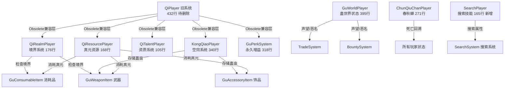
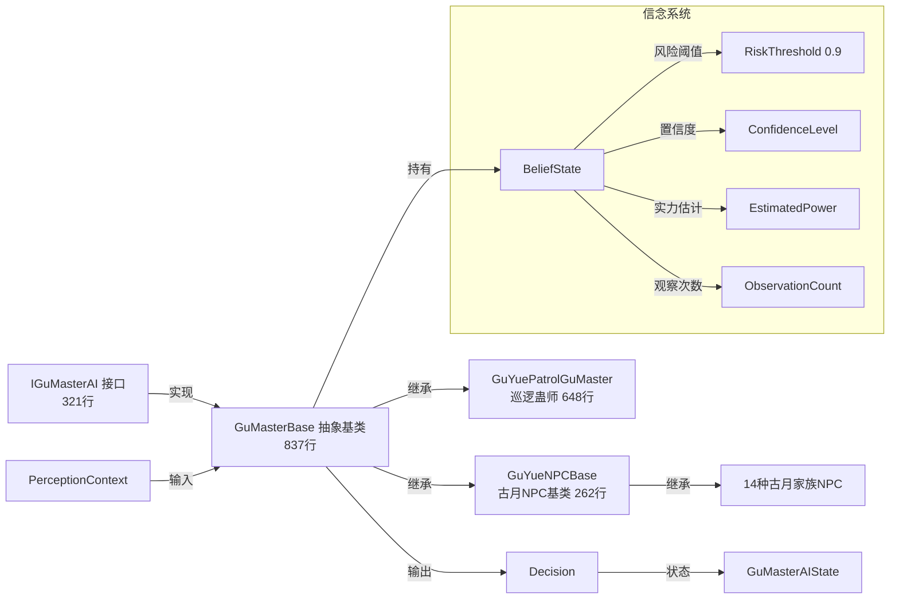
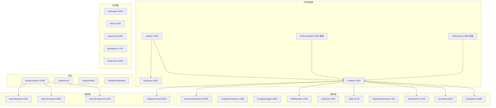
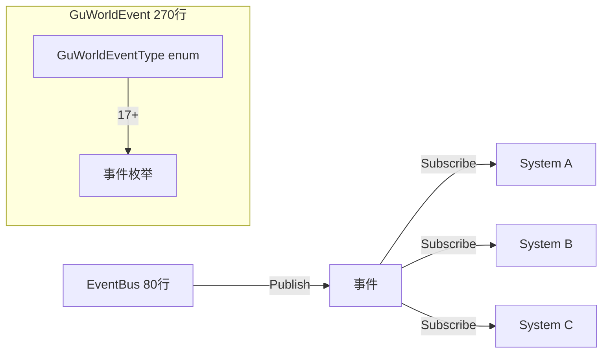
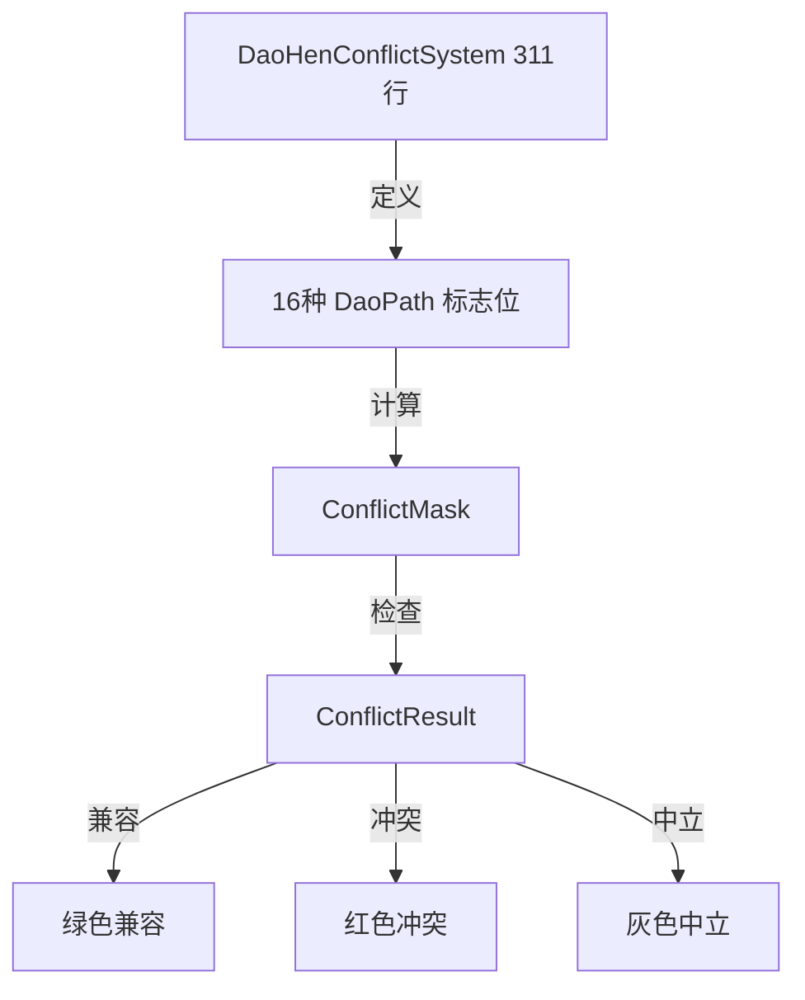
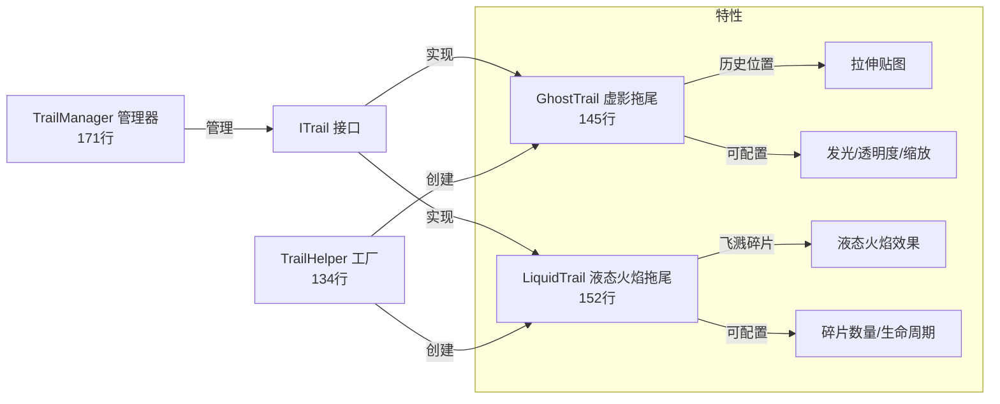
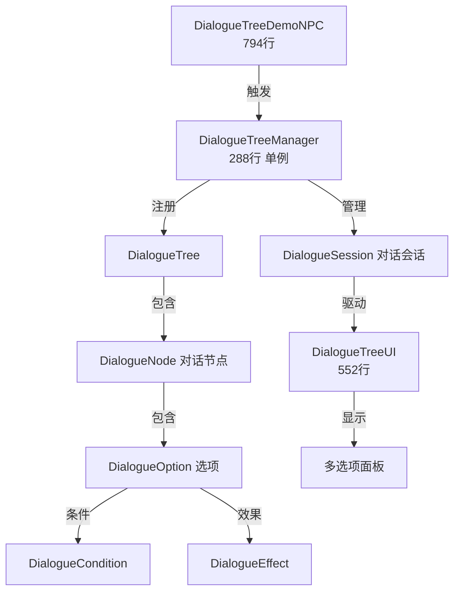
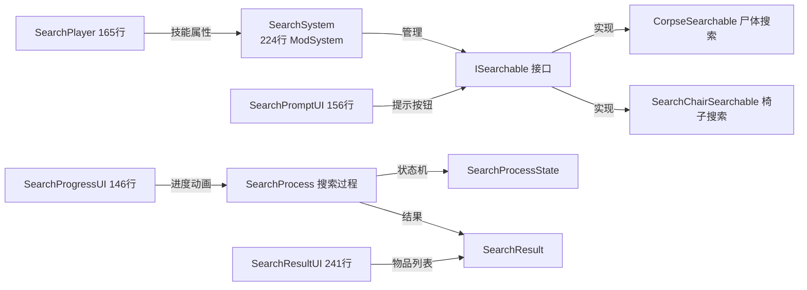

# VerminLordMod（蛊真人Mod）项目全景分析报告

> 生成时间：2026-05-02
> 版本：1.1.0.4
> 作者：風笙咲
> 基于小说《蛊真人》（Reverend Insanity）

---

## 一、项目概览

| 项目 | 内容 |
|------|------|
| 名称 | VerminLordMod（蛊真人Mod） |
| 类型 | Terraria tModLoader Mod（net8.0） |
| 版本 | 1.1.0.4 |
| 作者 | 風笙咲 |
| 依赖 | SubworldLibrary@2.2.2.2, ParticleLibrary.dll |
| 本地化 | zh-Hans（3053行）, en-US（3016行） |
| 开发阶段 | MVA（Minimum Viable Alpha），大量P2系统标记为未来扩展 |

---

## 二、目录结构总览

```
VerminLordMod/
├── build.txt                          # 项目元数据
├── Properties/launchSettings.json     # 启动配置
├── ParticleLibrary.dll/.xml           # 粒子库依赖
├── Content/                           # 游戏内容（核心）
│   ├── VerminLordModSystem.cs         # Mod主系统（PostUpdate钩子）
│   ├── Fucs.cs                        # 工具函数（拖尾、发光、叠加混合）
│   ├── Finder.cs                      # NPC查找工具
│   ├── Text.cs                        # 文本显示工具
│   ├── Randommer.cs                   # 随机数工具
│   ├── LiquidTrailManager.cs          # 【已废弃】液态拖尾管理器
│   ├── Trails/                        # 【新增】拖尾系统（5文件）
│   │   ├── ITrail.cs                  # 拖尾接口
│   │   ├── TrailManager.cs            # 拖尾管理器（171行）
│   │   ├── GhostTrail.cs              # 虚影拖尾（145行）
│   │   ├── LiquidTrail.cs             # 液态火焰拖尾（152行）
│   │   └── TrailHelper.cs             # 拖尾便捷工厂（134行）
│   ├── Items/                         # 物品系统
│   │   ├── IGu.cs                     # 蛊虫标记接口
│   │   ├── GuLists.cs                 # 顽石开出蛊虫列表（37种）
│   │   ├── Weapons/                   # 武器类蛊虫
│   │   │   ├── GuWeaponItem.cs        # 武器基类（炼化系统）
│   │   │   ├── Daos/                  # 道域武器（51种道域）
│   │   │   └── Four/                  # 四转武器（18种）
│   │   ├── Accessories/               # 饰品/防具类蛊虫
│   │   │   ├── GuAccessoryItem.cs     # 饰品基类
│   │   │   ├── One/                   # 一转饰品（7种）
│   │   │   ├── Two/                   # 二转饰品（2种）
│   │   │   ├── Three/                 # 三转饰品（3种）
│   │   │   └── Four/                  # 四转饰品（5种）
│   │   ├── Consumables/               # 消耗品类蛊虫（41种）
│   │   │   ├── GuConsumableItem.cs    # 消耗品基类
│   │   │   ├── WanShi.cs              # 顽石（抽蛊）
│   │   │   ├── YuanS.cs               # 元石（货币物品）
│   │   │   ├── Zizhi*.cs              # 资质丹（甲乙丙丁）
│   │   │   ├── Shari*.cs              # 沙砾系列（5种）
│   │   │   ├── WineBug*.cs            # 酒虫系列
│   │   │   ├── PigGu*.cs              # 豕蛊系列
│   │   │   ├── LifeGu*.cs             # 命蛊系列
│   │   │   ├── RealmBreak*.cs         # 破境丹系列
│   │   │   └── ...                    # 其他消耗品
│   │   ├── Placeable/                 # 可放置物品
│   │   │   ├── Furniture/             # 青茅石家具（11种）
│   │   │   ├── BoneBanbooBlock.cs     # 骨竹块
│   │   │   ├── MiZongZhenItem.cs      # 迷踪阵物品
│   │   │   ├── MoonlightCreeper.cs    # 月光藤
│   │   │   ├── MusicBoxes/            # 音乐盒（2种）
│   │   │   └── SubworldPortalGuYue.png# 古月子世界传送门
│   │   └── Debuggers/                 # 调试道具（21种）
│   │       ├── Bugger.cs, ChunQiuChanna.cs, DanmakuTestWeapon.cs
│   │       ├── Enter.cs, Gua.cs, Info.cs, NpcDebugger.cs
│   │       ├── PeppaPig.cs, Posioner.cs, QuickQi.cs
│   │       ├── ReputationReset.cs, SetMax.cs, TYBL.cs
│   │       ├── UITester.cs, ZZSetting.cs
│   │       ├── AttitudeSwitcher.cs, BeliefModifier.cs       # 信念调试
│   │       ├── DialogueDebugger.cs, DialogueTreeSummon.cs   # 对话树调试
│   │       ├── PersonalitySwitcher.cs, SimpleUIToggle.cs    # UI/性格调试
│   │       └── SearchChair/             # 搜索椅子系统
│   ├── NPCs/                          # NPC系统
│   │   ├── Boss/                      # Boss
│   │   │   └── ElectricWolfKing.cs    # 雷电狼王（560行，二阶段）
│   │   ├── Enemy/                     # 普通敌怪（4种）
│   │   │   ├── ElectricWolf.cs        # 电狼
│   │   │   ├── StrongElectricWolf.cs  # 强电狼
│   │   │   ├── LegionAnt.cs           # 军团蚁
│   │   │   └── BladeBloodBatGu.cs     # 刀翅血蝠蛊
│   │   ├── GuMasters/                 # 蛊师NPC（新体系）
│   │   │   ├── IGuMasterAI.cs         # 智能接口（321行）
│   │   │   ├── GuMasterBase.cs        # 抽象基类（837行）
│   │   │   └── GuYuePatrolGuMaster.cs # 古月巡逻蛊师（648行）
│   │   ├── GuYue/                     # 古月家族NPC（14种）
│   │   │   ├── GuYueNPCBase.cs        # 古月NPC基类（262行）
│   │   │   ├── GuYueNPCEnums.cs       # 角色类型枚举+配置（257行）
│   │   │   ├── GuYueChief.cs          # 族长
│   │   │   ├── GuYueSchoolElder.cs    # 学堂家老
│   │   │   ├── GuYueMedicineElder.cs  # 药堂家老
│   │   │   ├── GuYueDefenseElder.cs   # 御堂家老
│   │   │   ├── GuYueChiElder.cs       # 赤脉家老
│   │   │   ├── GuYueMoElder.cs        # 漠脉家老
│   │   │   ├── GuYueMedicinePulseElder.cs # 药脉家老
│   │   │   ├── GuYueFirstTurnGuMaster.cs  # 一转蛊师
│   │   │   ├── GuYueSecondTurnGuMaster.cs # 二转蛊师
│   │   │   ├── GuYueFistInstructor.cs # 拳脚教头
│   │   │   ├── GuYueServant.cs        # 杂役
│   │   │   └── GuYueCommoner.cs       # 凡人
│   │   ├── Town/                      # 城镇NPC（5种）
│   │   │   ├── BaiA.cs                # 白阿（商人）
│   │   │   ├── XueTangJiaLao.cs       # 学堂家老（城镇版）
│   │   │   ├── YaoTangJiaLao.cs       # 药堂家老（城镇版）
│   │   │   ├── YuTangJiaLao.cs        # 御堂家老（城镇版）
│   │   │   └── JiasTravelingMerchant.cs # 贾氏行商
│   │   └── DialogueTreeDemoNPC.cs     # 【新增】对话树演示员（794行）
│   ├── Projectiles/                   # 投射物系统（69种）
│   │   ├── Minions/                   # 召唤物
│   │   │   └── DogControlGuMinion.cs  # 驭犬蛊召唤物
│   │   └── *.cs                       # 各种弹幕投射物
│   ├── Tiles/                         # 方块系统
│   │   ├── YuanSOre.cs                # 元石矿
│   │   ├── BoneBanbooBlock.cs         # 骨竹块
│   │   ├── MoonlightCreeper.cs        # 月光藤
│   │   ├── MusicBoxTiles/             # 音乐盒方块（2种）
│   │   ├── QingMaoStoneBlock.cs       # 青茅石块
│   │   ├── Banners/                   # 敌怪旗
│   │   ├── Furniture/                 # 青茅石家具（13种，含搜索椅）
│   │   └── GuYueArchitecture/         # 古月建筑方块（16种）
│   ├── Buffs/                         # Buff系统
│   │   ├── AddToEnemy/                # 对敌Debuff（13种）
│   │   ├── AddToSelf/                 # 对己Buff
│   │   │   ├── Pobuff/                # 正面Buff（44种）
│   │   │   └── Debuff/                # 负面Buff（7种）
│   │   └── Combo/                     # 连击Buff（5种）
│   │       ├── GoldMoonCut/           # 金月斩连击
│   │       └── IceBladeStorm/         # 冰刃风暴连击
│   ├── Biomes/                        # 生物群落
│   │   ├── QingMaoSurfaceBiome.cs     # 青毛地表
│   │   ├── QingMaoUndergroundBiome.cs # 青毛地下
│   │   ├── GuYueCompoundBiome.cs      # 古月山寨
│   │   ├── WaterStyle/                # 水体风格
│   │   └── BackgroundStyle/           # 背景风格
│   ├── DamageClasses/                 # 伤害类型
│   │   └── InsectDamageClass.cs       # 蛊虫伤害类型
│   ├── Currencies/                    # 货币系统
│   │   └── YuanSCurrency.cs           # 元石货币
│   ├── Dusts/                         # 粒子系统（51种道域粒子）
│   │   ├── BanDust.cs (斑), BloodDust.cs (血), BoneDust.cs (骨)
│   │   ├── CharmDust.cs (魅), CloudDust.cs (云), DarkDust.cs (暗)
│   │   ├── DrawDust.cs (画), DreamDust.cs (梦), EatingDust.cs (食)
│   │   ├── FireDust.cs (火), FlyingDust.cs (飞), GoldDust.cs (金)
│   │   ├── IceSnowDust.cs (冰雪), InfoDust.cs (信), KillingDust.cs (杀)
│   │   ├── KnifeDust.cs (刀), LifeDeathDust.cs (生死), LightDust.cs (光)
│   │   ├── LightningDust.cs (雷), LoveDust.cs (爱), LuckDust.cs (运)
│   │   ├── MoonDust.cs (月), MudDust.cs (土), PelletDust.cs (丸)
│   │   ├── PersonDust.cs (人), PoisonDust.cs (毒), PowerDust.cs (力)
│   │   ├── PractiseDust.cs (炼), QiDust.cs (气), RuleDust.cs (规)
│   │   ├── ShadowDust.cs (影), SkyDust.cs (天), SlaveDust.cs (奴)
│   │   ├── SoulDust.cs (魂), SpaceDust.cs (宙), StarDust.cs (星)
│   │   ├── StealingDust.cs (偷), SuccessFailureDust.cs (成败)
│   │   ├── SwordDust.cs (剑), TacticalDust.cs (阵), TimeDust.cs (时)
│   │   ├── UnrealDust.cs (幻), VariationDust.cs (变), VoiceDust.cs (音)
│   │   ├── VoidDust.cs (虚), WarDust.cs (战), WaterDust.cs (水)
│   │   ├── WindDust.cs (风), WisdomDust.cs (智), WoodDust.cs (木)
│   │   └── YinYangDust.cs (阴阳)
│   └── SmoothMovement/                # 平滑运动框架
│       ├── Interpolators/             # 插值器（3种）
│       ├── Orbiters/                  # 轨道器（3种）
│       ├── Trackers/                  # 追踪器（3种）
│       └── StateMachine/              # 状态机（2种）
├── Common/                            # 通用系统
│   ├── IWeaponCanReforge.cs           # 武器可重铸标记接口
│   ├── IAccCanReforge.cs              # 饰品可重铸标记接口
│   ├── Configs/                       # 配置
│   │   └── VerminLordModConfig.cs     # 配置（LimitSth）
│   ├── Entities/                      # 实体
│   │   └── NpcCorpse.cs               # NPC尸体（394行，Projectile实体）
│   ├── Events/                        # 事件系统
│   │   ├── EventBus.cs                # 通用事件总线（80行）
│   │   └── GuWorldEvent.cs            # 蛊世界事件（270行，17+事件类型）
│   ├── DialogueTree/                  # 【新增】对话树系统（6文件）
│   │   ├── DialogueTreeManager.cs     # 对话树管理器（288行）
│   │   ├── DialogueNode.cs            # 对话节点
│   │   ├── DialogueSession.cs         # 对话会话
│   │   ├── DialogueCondition.cs       # 对话条件
│   │   ├── DialogueEffect.cs          # 对话效果
│   │   └── DialogueTreeBuilder.cs     # 对话树构建器
│   ├── Search/                        # 【新增】搜索系统（6文件）
│   │   ├── SearchSystem.cs            # 搜索系统核心（224行）
│   │   ├── SearchProcess.cs           # 搜索过程
│   │   ├── SearchResult.cs            # 搜索结果
│   │   ├── ISearchable.cs             # 可搜索接口
│   │   ├── CorpseSearchable.cs        # 尸体搜索
│   │   └── SearchChairSearchable.cs   # 椅子搜索
│   ├── GlobalItems/                   # 全局物品
│   │   ├── GlobalLoots.cs             # 全局战利品（已清空）
│   │   ├── GlobalPrefix.cs            # 全局词缀系统
│   │   └── RenameGlobalItem.cs        # 物品重命名
│   ├── GlobalNPCs/                    # 全局NPC
│   │   ├── GlobalDeadMsg.cs           # 死亡消息
│   │   ├── GlobalNPCCorpseHandler.cs  # NPC尸体处理（263行）
│   │   ├── GlobalNPCLoot.cs           # NPC战利品（315行）
│   │   └── GlobalWolf.cs              # 狼潮生成控制
│   ├── Players/                       # 玩家系统（10个ModPlayer）
│   │   ├── QiPlayer.cs                # 【旧】核心玩家系统（432行，待删除）
│   │   ├── QiResourcePlayer.cs        # 真元资源系统（168行）
│   │   ├── QiRealmPlayer.cs           # 境界系统（176行）
│   │   ├── QiTalentPlayer.cs          # 资质系统（105行）
│   │   ├── KongQiaoPlayer.cs          # 空窍系统（340行）
│   │   ├── GuPerkSystem.cs            # 永久增益系统（318行）
│   │   ├── GuWorldPlayer.cs           # 蛊世界模拟状态（395行）
│   │   ├── ChunQiuChanPlayer.cs       # 春秋蝉回溯系统（271行）
│   │   ├── CorpsePlayer.cs            # 尸体交互系统（29行）
│   │   ├── EffectsPlayer.cs           # 特效系统（110行）
│   │   └── SearchPlayer.cs            # 【新增】搜索技能组件（165行）
│   ├── Systems/                       # 系统类（18个ModSystem）
│   │   ├── GuWorldSystem.cs           # 蛊世界系统（258行）
│   │   ├── WorldEventSystem.cs        # 世界事件系统（305行）
│   │   ├── DownBossSystem.cs          # Boss击败追踪（114行）
│   │   ├── NpcDeathHandler.cs         # NPC死亡处理（405行）
│   │   ├── LootSystem.cs              # 战利品系统（412行）
│   │   ├── TradeSystem.cs             # 交易系统（248行）
│   │   ├── BountySystem.cs            # 悬赏系统（407行）
│   │   ├── DaoHenConflictSystem.cs    # 道痕冲突系统（311行）
│   │   ├── DialogueSystem.cs          # 对话系统（253行）
│   │   ├── PowerStructureSystem.cs    # 权力结构系统（390行）
│   │   ├── DefenseSystem.cs           # 防御系统/迷踪阵（303行）
│   │   ├── HeavenTribulationSystem.cs # 天劫系统（398行）
│   │   ├── ResourceNodeSystem.cs      # 资源节点系统（287行）
│   │   ├── WolfSystem.cs              # 狼潮系统（72行）
│   │   ├── PlayerEffectDrawSystem.cs  # 玩家特效绘制（23行）
│   │   ├── QingMaoBiomeTileCount.cs   # 青毛群落方块计数（15行）
│   │   ├── TravelMerchantSystem.cs    # 行商系统（17行，占位）
│   │   └── RecipeGroupSystem.cs       # 配方组系统（27行，编码损坏）
│   ├── SubWorlds/                     # 子世界系统
│   │   ├── Example.cs                 # 示例子世界（79行）
│   │   ├── GuYueTerritory.cs          # 古月族地（710行）
│   │   └── GuYueTerritoryNPCSystem.cs # 古月族地NPC管理（321行）
│   └── UI/                            # UI系统
│       ├── UIUtils/                   # UI工具层（5文件）
│       │   ├── UIStyles.cs            # 统一风格定义（164行）
│       │   ├── UIHelper.cs            # UI辅助工厂（243行）
│       │   ├── EasyDraw.cs            # SpriteBatch状态保持（145行）
│       │   ├── GuiEnumHelper.cs       # 【新增】枚举中文名/颜色辅助（206行）
│       │   └── UIRendering.cs         # 【新增】UI渲染工具类（148行）
│       ├── DeepLootUI.cs              # 尸体战利品UI（329行，旧框架）
│       ├── DaosUI/DaosUI.cs           # 道痕UI（119行，占位）
│       ├── QiUI/QiBar.cs              # 真元条HUD（217行）
│       ├── KongQiaoUI/                # 空窍UI套件
│       │   ├── KongQiaoUI.cs          # 空窍面板（209行）
│       │   ├── KongQiaoUISystem.cs    # 空窍UI生命周期（148行）
│       │   ├── KongQiaoToggle.cs      # 空窍入口按钮（130行）
│       │   ├── GuCraftUI.cs           # 合炼面板（634行）
│       │   ├── GuRecipe.cs            # 蛊虫配方（461行）
│       │   └── UIItemSlot.cs          # 物品槽位（143行）
│       ├── ReputationUI/              # 声望UI
│       │   ├── ReputationUI.cs        # 声望面板（124行）
│       │   └── ReputationUISystem.cs  # 声望UI生命周期（72行）
│       ├── WolfWaveUI/WolfWaveBar.cs  # 狼潮进度条（135行）
│       ├── DanmakuUI/DanmakuSelectionUI.cs # 弹幕选择UI（392行）
│       ├── DialogueTreeUI/            # 【新增】对话树UI
│       │   └── DialogueTreeUI.cs      # 对话树自定义面板（552行）
│       ├── SearchUI/                  # 【新增】搜索UI（3文件）
│       │   ├── SearchProgressUI.cs    # 搜索进度UI（146行）
│       │   ├── SearchPromptUI.cs      # 搜索提示UI（156行）
│       │   └── SearchResultUI.cs      # 搜索结果UI（241行）
│       ├── SimpleUI/                  # SimpleUI独立系统（9文件）
│       │   ├── SimpleUISystem.cs      # SimpleUI管理器（379行）
│       │   ├── SimplePanel.cs         # 简单面板
│       │   ├── SimpleInfoBox.cs       # 信息提示框
│       │   ├── SimpleButton.cs        # 简单按钮
│       │   ├── SimpleItemSlot.cs      # 简单物品槽
│       │   ├── SimpleFixedGroup.cs    # 固定组
│       │   ├── SimpleAnimSlotRow.cs   # 动画槽行
│       │   ├── SimpleSubPanel.cs      # 子面板
│       │   └── SimpleLightBox.cs      # 灯箱
│       └── RefineRecipeCallbacks.cs   # 炼化配方回调（41行）
├── Assets/                            # 资源文件
│   ├── Music/                         # 音乐（2首）
│   └── Textures/                      # 纹理
├── Localization/                      # 本地化
│   ├── zh-Hans_Mods.VerminLordMod.hjson (3053行)
│   └── en-US_Mods.VerminLordMod.hjson (3016行)
├── plans/                             # 架构计划文档
│   ├── L1-System-Panorama-FINAL.md    # 系统全景（447行，27个锁定决策）
│   ├── L2-System-Interfaces-v1.1.md   # 接口设计（1187行）
│   ├── L3-GuYuePatrolGuMaster-v1.2.md # 古月巡逻蛊师详细设计
│   ├── L3-LootTrade-v1.md             # 战利品/交易详细设计
│   ├── L3-MediumWeapon-v1.md          # 中级武器详细设计
│   ├── L3-NpcDeathHandler-v1.md       # NPC死亡处理详细设计
│   ├── L3-P2-Systems-v1.md            # P2系统详细设计
│   ├── L3-QiPlayer-KongQiao-v2.md     # QiPlayer/空窍详细设计
│   ├── 现有基础.md                     # 现有基础分析（490行）
│   ├── UI技术说明.md                   # UI技术文档（365行）
│   ├── 弹幕拖尾系统统一整理计划.md       # 拖尾系统计划
│   ├── 行动计划.md                     # 开发行动计划
│   ├── 项目全景分析报告.md              # 本文件
│   ├── 贴图创作提示词.md               # 贴图创作提示词
│   ├── 搜索系统设计方案.md              # 搜索系统设计
│   ├── 对话树设计方案.md               # 对话树设计
│   ├── 对话树调试方案.md               # 对话树调试
│   ├── 对话选项扩展框架.md              # 对话选项扩展
│   └── UI框架评估报告.md               # UI框架评估
├── helps/                             # 辅助文件
│   └── alignment_report.md            # 小说实体对齐报告（12092行，4925实体）
└── Properties/                        # 项目属性
```

---

## 三、核心架构分析

### 3.1 玩家系统架构（双轨制重构）

项目正在进行从旧 `QiPlayer` 到新 `ModPlayer` 子系统的重构：



**关键发现**：
- `QiPlayer` 仍保留432行代码，通过 `[Obsolete]` 属性提供向后兼容
- 新系统之间通过 `player.GetModPlayer<T>()` 互相引用
- 重构尚未完全完成，部分代码仍直接引用 `QiPlayer`
- **新增** `SearchPlayer`（165行）管理搜索技能属性（速度/精度/警觉/知识）

### 3.2 蛊师NPC体系（信念驱动AI）



**设计亮点**：
- 信念黑箱替代确定性态度计算（黑暗森林设计哲学）
- 每个NPC对每个玩家独立维护信念状态
- 感知上下文包含距离、生命、恶名、修为等10+维度
- 决策结果包含状态切换、攻击/逃跑/呼救等行为

### 3.3 UI系统架构（多框架并行）



**四套UI框架对比**：

| 维度 | UIManager框架 | UIState框架 | SimpleUI框架 | 新增UI（独立） |
|------|--------------|-------------|-------------|--------------|
| 架构 | 自研轻量 | tModLoader标准 | 独立自研 | 独立自研 |
| 复杂度 | 低 | 中 | 中 | 中-高 |
| 使用场景 | 尸体战利品UI | 空窍/合炼/声望/真元条 | 搜索UI基础组件 | 对话树/搜索进度/提示/结果 |
| 状态管理 | 手动 | UserInterface | 手动 | 手动 |
| 可维护性 | 低 | 高 | 中 | 中 |

### 3.4 事件系统



### 3.5 道痕冲突系统



**16种道域**：力量、生命、变化、大地、智慧、星辰、风、云、水、火、光、暗、雷、毒、血、骨

### 3.6 词缀系统

| 类型 | 词缀 | 效果 |
|------|------|------|
| 武器（8种） | 外向/羞怯/温和/极端/活跃/内向/垂死/自闭 | 伤害/暴击/攻速/击退修正 |
| 饰品（6种） | 甲壳/鞘翅/蜷缩/伸展/利爪/尖牙 | 防御/闪避/生命/伤害修正 |

### 3.7 【新增】拖尾系统



**设计要点**：
- 统一 `ITrail` 接口，替代原 `Fucs.cs` 中的分散拖尾逻辑
- `TrailManager` 支持多拖尾并行管理，可用于弹幕和玩家
- `TrailHelper` 提供扩展方法快速创建配置好的拖尾
- `GhostTrail` 继承原 Fucs 风格，`LiquidTrail` 继承原 LiquidTrailManager 风格
- `LiquidTrailManager.cs` 标记为已废弃，由新系统替代

### 3.8 【新增】对话树系统



**设计要点**：
- 突破原版2按钮限制，支持任意数量选项
- 支持条件分支（境界/声望/任务状态等）
- 支持效果执行（给予物品/触发事件/修改声望等）
- 演示员NPC（794行）覆盖7种态度 x 多分支的完整测试

### 3.9 【新增】搜索系统



**设计要点**：
- 搜索技能四维属性：速度、精度、警觉、知识
- 搜索过程状态机：Idle → Searching → Success/Failed
- 三套UI覆盖提示→进度→结果全流程
- 可扩展：通过实现 `ISearchable` 接口添加新搜索目标

---

## 四、数据流分析

### 4.1 真元消耗流程
```
玩家使用蛊虫武器
  → GuWeaponItem.UseItem()
    → QiResourcePlayer.ConsumeQi(qiCost)
      → 检查 QiCurrent >= qiCost
        → 扣除真元
        → 检查 QiCurrent < QiMax * 0.2 → 触发低真元惩罚
```

### 4.2 炼化流程
```
玩家右键蛊虫物品
  → GuAccessoryItem.CanUseItem() / GuWeaponItem
    → 检查 QiCurrent >= controlQiCost
      → 扣除真元
      → controlRate += unitControlRate
      → 当 controlRate >= 100 → hasBeenControlled = true
        → 再次右键 → TryRefineGu() → 炼入空窍
```

### 4.3 境界突破流程
```
玩家使用破境丹
  → 检查 QiCurrent >= QiCost
  → 检查 GuLevel 匹配
  → 扣除真元
  → QiRealmPlayer.Breakthrough()
    → 更新 GuLevel
    → 更新 GuRealmStage (初期/中期/后期/巅峰)
    → 触发特效
```

### 4.4 狼潮事件流程
```
WorldEventSystem 触发 WolfWave 事件
  → WolfSystem.isWolfWave = true
  → GlobalWolf 增加狼类生成率 (spawnRate=27, maxSpawns=200)
  → WolfWaveBar 显示进度条
  → 击杀狼类增加 WolfWaveRate
  → WolfWaveRate >= 100 → 狼潮结束
```

### 4.5 蛊师NPC信念驱动流程
```
GuMasterBase.AI() 每帧执行
  → CollectPerception() 收集感知上下文
  → UpdateBelief() 更新对玩家的信念
  → MakeDecision() 基于信念做出决策
    → 风险阈值高 + 置信度低 → Ignore/观察
    → 风险阈值低 + 置信度高 → 攻击
    → 被击败过 → 逃跑/更谨慎
  → ExecuteDecision() 执行行为
```

### 4.6 声望交互流程
```
玩家与蛊师NPC交互
  → 检查 GuWorldPlayer.FactionReputation[FactionID]
  → TradeSystem 计算价格:
    Price = basePrice × urgency × (1/reputationMultiplier) × (1/archetypeMultiplier)
  → 交互后更新声望
  → 声望影响 NPC 态度和交易价格
```

### 4.7 世界事件触发流程
```
WorldEventSystem.Update() 每帧
  → 检查事件冷却
  → 随机触发可用事件
  → 发布到 EventBus
  → 订阅者响应事件
```

### 4.8 春秋蝉回溯流程
```
玩家死亡
  → ChunQiuChanPlayer.OnRespawn()
    → 检查是否有春秋蝉
    → 恢复死亡前的状态快照
    → 消耗春秋蝉
    → 触发时间回溯特效
```

### 4.9 【新增】搜索流程
```
玩家靠近可搜索目标
  → SearchSystem 检测 NearbyTarget
  → SearchPromptUI 显示"搜索"按钮
  → 玩家点击 → SearchProcess 开始
  → SearchProgressUI 显示进度动画
  → 搜索完成 → SearchResultUI 显示物品列表
  → 玩家拾取物品 → 搜索结束
```

### 4.10 【新增】对话树流程
```
玩家与对话树NPC交互
  → DialogueTreeManager 加载对应对话树
  → DialogueTreeUI 显示NPC文本 + 选项列表
  → 玩家选择选项
  → 检查 DialogueCondition 条件
  → 执行 DialogueEffect 效果
  → 加载下一节点 / 关闭对话
```

---

## 五、已识别的问题和改进点

### 5.1 编码损坏
- [`Common/Systems/RecipeGroupSystem.cs`](Common/Systems/RecipeGroupSystem.cs) — 文件被空字节损坏，需要重写

### 5.2 代码质量问题
1. **`QiPlayer` 遗留代码**（432行）— 标记为 `[Obsolete]` 但仍有大量引用，需逐步迁移
2. **`GuAccessoryItem` 注释掉的Tooltip代码** — 本地化工具提示被注释，使用硬编码字符串
3. **`GlobalLoots.cs`** — 所有方法被注释掉，文件为空壳
4. **`TravelMerchantSystem.cs`** — 仅17行占位代码
5. **`LiquidTrailManager.cs`** — 标记为已废弃，但 `VerminLordModSystem` 可能仍引用它

### 5.3 架构问题
6. **多框架UI维护成本** — UIManager/UIState/SimpleUI/独立UI四套框架并行，增加维护复杂度
7. **ModPlayer间耦合** — 新系统通过 `GetModPlayer<T>()` 互相引用，形成隐式依赖网
8. **事件系统使用不足** — `EventBus` 已实现但许多系统仍直接耦合
9. **配置系统薄弱** — 仅 `LimitSth` 一个配置项

### 5.4 内容缺失
10. **大量P2系统未实现** — 权力结构、天劫、资源节点等系统标记为MVA占位
11. **道痕UI占位** — `DaosUI.cs` 仅119行，功能未实现
12. **行商系统占位** — 仅17行
13. **51种道域粒子已定义但未在游戏中充分使用**

### 5.5 性能考虑
14. **NPC信念系统每帧计算** — 每个蛊师NPC对每个玩家维护信念状态，多NPC多玩家场景可能有性能问题
15. **尸体系统** — 每个屏幕最多10个尸体，每个尸体作为Projectile实体，需关注性能

### 5.6 本地化
16. **中英文本地化基本完整**（3053/3016行），但部分新系统可能缺少翻译
17. **部分硬编码字符串**仍存在于代码中

---

## 六、项目亮点

1. **架构文档完善** — L1/L2/L3三级计划文档，27个锁定设计决策
2. **设计哲学清晰** — 黑暗森林、信息不透明、不可逆性、零和博弈
3. **信念驱动AI** — 创新的NPC智能系统，替代传统确定性态度
4. **道痕冲突系统** — 16种道域的兼容/冲突矩阵
5. **51种道域粒子** — 完整的视觉表现系统（原36种扩展至51种）
6. **春秋蝉回溯** — 独特的时间回溯机制
7. **动态定价系统** — 基于声望/紧迫性/性格的浮动价格
8. **小说实体对齐** — 4925个实体的完整数据库
9. **多UI框架** — 灵活应对不同复杂度需求
10. **平滑运动框架** — 插值器/轨道器/追踪器/状态机完整体系
11. **【新增】拖尾系统** — 统一ITrail接口，虚影/液态双实现
12. **【新增】对话树系统** — 突破原版2按钮限制，条件分支+效果执行
13. **【新增】搜索系统** — 四维技能属性，全流程UI覆盖

---

## 七、项目规模统计

| 类别 | 数量 |
|------|------|
| 总代码文件 | 300+ |
| 玩家系统 | 11个ModPlayer（新增SearchPlayer） |
| 系统类 | 18个ModSystem |
| 物品 | 140+（武器51道域+18四转，饰品17，消耗品41，调试21） |
| NPC | 25+（1 Boss, 4 Enemy, 3 GuMaster, 14 GuYue, 5 Town, 1 DemoNPC） |
| 投射物 | 69种弹幕 + 1召唤物 |
| Buff | 69种（13对敌Debuff, 44正面Buff, 7负面Buff, 5连击Buff） |
| 方块 | 35+（2矿石/植物, 2音乐盒, 1旗帜, 13家具, 16建筑, 1搜索椅） |
| 粒子 | 51种道域Dust |
| 生物群落 | 3种（青毛地表/地下, 古月山寨）+ 水体/背景风格 |
| UI文件 | 30+（5工具, 4框架, 10+面板, 9 SimpleUI, 4新增UI） |
| 调试道具 | 21种 |
| 拖尾系统 | 5文件（1接口, 1管理器, 2实现, 1工厂） |
| 对话树系统 | 6文件（1管理器, 1节点, 1会话, 1条件, 1效果, 1构建器） |
| 搜索系统 | 6文件（1核心, 1过程, 1结果, 1接口, 2搜索目标） |
| 子世界 | 3个（示例, 古月族地, 族地NPC管理） |
| 平滑运动 | 11文件（3插值器, 3轨道器, 3追踪器, 2状态机） |
| 计划文档 | 15+ |
| 本地化 | zh-Hans 3053行 / en-US 3016行 |
| 小说实体对齐 | 12092行, 4925实体 |

---

## 八、近期新增/变更摘要（2026-05）

### 8.1 新增系统
| 系统 | 文件数 | 总行数 | 说明 |
|------|--------|--------|------|
| 拖尾系统 | 5 | ~620 | 统一ITrail接口，替代分散拖尾逻辑 |
| 对话树系统 | 6 | ~800+ | 突破2按钮限制，条件分支+效果 |
| 搜索系统 | 6 | ~700+ | 四维技能，全流程UI |
| 搜索UI | 3 | ~543 | 提示/进度/结果三件套 |
| 对话树UI | 1 | 552 | 自定义对话面板 |
| 搜索玩家 | 1 | 165 | 搜索技能属性组件 |
| 对话树演示NPC | 1 | 794 | 7态度x多分支测试 |

### 8.2 新增/扩展内容
| 类别 | 原数量 | 现数量 | 变化 |
|------|--------|--------|------|
| 道域武器 | 25种 | 51种 | +26种（完整道域覆盖） |
| 调试道具 | 14种 | 21种 | +7种（信念/对话树/性格调试） |
| 道域粒子 | 36种 | 51种 | +15种（完整道域覆盖） |
| 投射物 | ~60种 | 69种 | +9种 |
| 消耗品 | 40+种 | 41种 | +1种 |
| 古月NPC | 13种 | 14种 | +1种 |
| 青茅石家具 | 11种 | 13种 | +2种（含搜索椅） |
| 古月建筑 | 17种 | 16种 | -1种（调整） |
| UI工具 | 3文件 | 5文件 | +2种（GuiEnumHelper, UIRendering） |
| 正面Buff | 40+种 | 44种 | +4种 |
| 对敌Debuff | 13种 | 13种 | 不变 |
| 计划文档 | 10+ | 15+ | +5种（拖尾/搜索/对话树/UI评估等） |

### 8.3 架构演进趋势
1. **从分散到统一**：拖尾逻辑从 `Fucs.cs` 分散实现 → 统一 `ITrail` 接口体系
2. **从占位到实现**：搜索系统、对话树系统从设计文档 → 完整实现
3. **UI框架扩展**：从3框架 → 4框架，新增独立UI组件
4. **调试工具丰富**：从14种 → 21种，覆盖信念/对话树/性格调试
5. **道域体系完整化**：武器和粒子从部分道域 → 51种完整道域覆盖