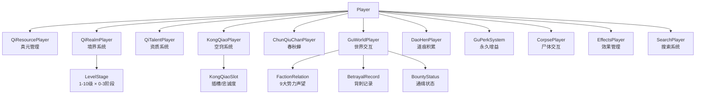
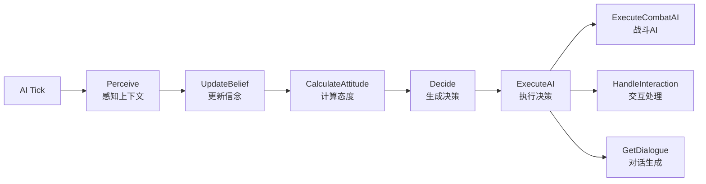
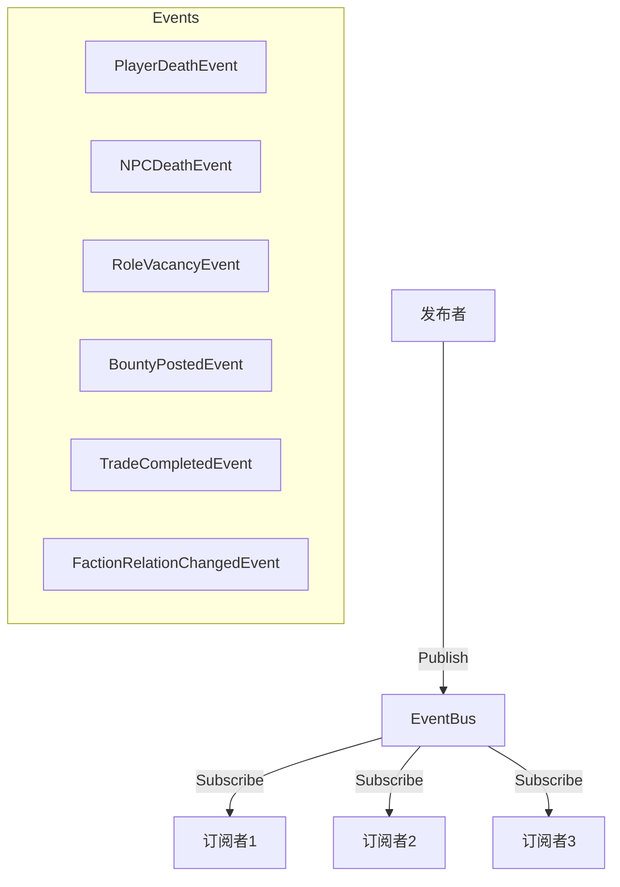
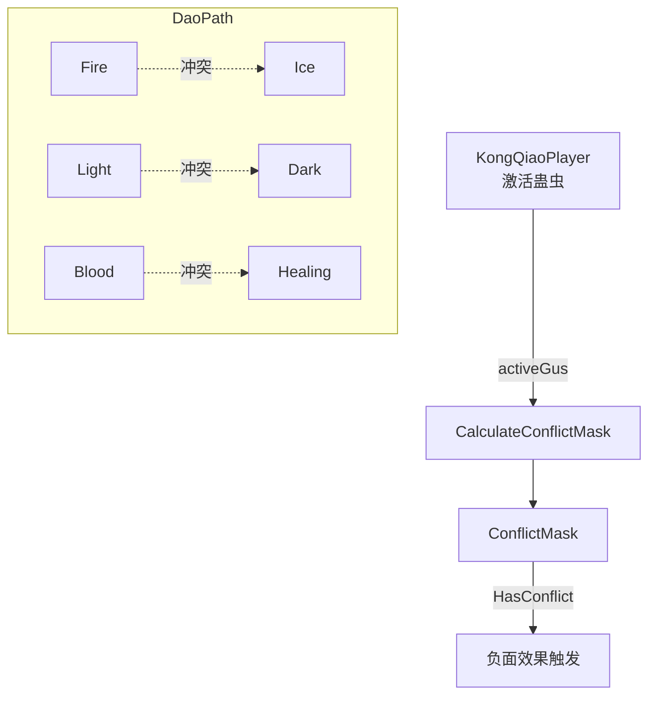
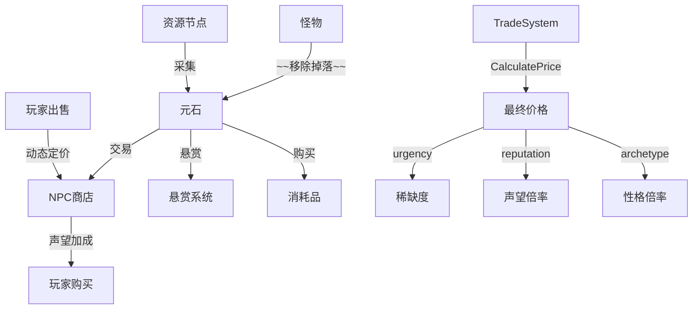

# VerminLordMod（蛊真人Mod）项目全景分析报告（v2.0 修正版）

> **说明**：本文档合并自 `plans/old/项目全景分析报告.md`（v1.0）和 `plans/old/L1-System-Panorama-FINAL.md`（v1.0），并基于实际代码库全面修正了所有过时/错误信息。  
> **最后更新**：2026-05-09  
> **修正记录**：见末尾 §12

---

## 一、项目概览

| 项目 | 值 |
|------|-----|
| **Mod 名称** | VerminLordMod（蛊真人Mod） |
| **版本** | 1.1.0.4 |
| **作者** | 風笙咲 |
| **平台** | Terraria tModLoader (1.4.4, .NET 8.0) |
| **外部依赖** | SubworldLibrary, ParticleLibrary |
| **核心主题** | 蛊师世界模拟 — 黑暗森林、信息不透明、不可逆性、零和博弈、维度隔离 |
| **代码总量** | ~45,000+ 行 C#（含 ~80 个弹幕文件、~50 个 Buff 文件、~50 个 Dao 武器文件、~15 个 NPC 文件、~25 个 UI 文件） |
| **设计哲学** | ① 黑暗森林（任意角色可能背叛）② 信息不透明（NPC 信念为黑盒）③ 不可逆性（永久性世界改变）④ 零和博弈（资源稀缺）⑤ 维度隔离（空窍 vs 背包） |

---

## 二、目录结构总览（修正版）

```
VerminLordMod/
├── Assets/                          # 贴图/音频资源
│   └── Music/ (NianLun.wav, Poem1.wav)
├── Common/
│   ├── Assets/                      # 旧版背景/UI 贴图（ExampleMod 遗留）
│   ├── BulletBehaviors/             # 弹幕行为组件（15 个）
│   │   ├── IBulletBehavior.cs       # 行为接口
│   │   ├── BaseBullet.cs            # 基础弹幕
│   │   ├── AcidSplashBehavior.cs    # 酸液溅射
│   │   ├── AimBehavior.cs           # 瞄准
│   │   ├── BounceBehavior.cs        # 弹跳
│   │   ├── ChargeWeaponTemplate.cs  # 蓄力武器模板
│   │   ├── CircleArrayDrawer.cs     # 圆形阵列绘制
│   │   ├── CircleSpawnHelper.cs     # 圆形生成辅助
│   │   ├── ConvergeProjectile.cs    # 汇聚弹幕
│   │   ├── DustKillBehavior.cs      # 击杀粒子
│   │   ├── DustTrailBehavior.cs     # 粒子拖尾
│   │   ├── ExplosionSpawnHelper.cs  # 爆炸生成
│   │   ├── GlowDrawBehavior.cs      # 发光绘制
│   │   ├── GravityBehavior.cs       # 重力
│   │   ├── HomingBehavior.cs        # 追踪
│   │   ├── LiquidBurstBehavior.cs   # 液体爆裂
│   │   ├── LiquidReactionBehavior.cs# 液体反应
│   │   ├── LiquidTrailHelper.cs     # 液体拖尾辅助
│   │   ├── RotateBehavior.cs        # 旋转
│   │   ├── TrailBehavior.cs         # 拖尾
│   │   └── WaveBehavior.cs          # 波浪
│   ├── Configs/
│   │   └── VerminLordModConfig.cs
│   ├── DialogueTree/                # 对话树系统
│   │   ├── DialogueCondition.cs
│   │   ├── DialogueEffect.cs
│   │   ├── DialogueNode.cs
│   │   ├── DialogueSession.cs
│   │   ├── DialogueTreeBuilder.cs
│   │   └── DialogueTreeManager.cs
│   ├── Entities/
│   │   └── NpcCorpse.cs             # NPC 尸体实体
│   ├── Events/                      # 事件系统（已实现）
│   │   ├── EventBus.cs              # 轻量级事件总线（80 行）
│   │   └── GuWorldEvent.cs          # 所有事件类型（~20 种）
│   ├── GlobalItems/
│   │   ├── GlobalLoots.cs
│   │   ├── GlobalPrefix.cs
│   │   └── RenameGlobalItem.cs
│   ├── GlobalNPCs/
│   │   ├── GlobalDeadMsg.cs
│   │   ├── GlobalNPCCorpseHandler.cs
│   │   ├── GlobalNPCLoot.cs         # 全局掉落（含 YuanS 掉落，需修正）
│   │   ├── GlobalWolf.cs
│   │   └── GuNPCInfo.cs             # NPC 状态效果（80 行）
│   ├── GlobalProjectiles/
│   │   └── GuProjectileInfo.cs      # 弹幕全局信息（33 行）
│   ├── GuBehaviors/
│   │   ├── DaoType.cs               # 50 种 DaoType 枚举
│   │   ├── DaoEffectTags.cs         # 效果标签枚举（Flags）
│   │   ├── DaoEffectSystem.cs       # 效果应用系统（85 行）
│   │   ├── IKinematicProvider.cs    # 运动学接口
│   │   ├── IOnHitEffectProvider.cs  # 命中效果接口
│   │   ├── ITacticalTriggerProvider.cs # 战术触发接口
│   │   └── TacticalTrigger.cs       # 战术触发枚举
│   ├── IAccCanReforge.cs            # 饰品重铸接口
│   ├── IWeaponCanReforge.cs         # 武器重铸接口
│   ├── Players/                     # 玩家层组件
│   │   ├── ChunQiuChanPlayer.cs     # 春秋蝉（271 行）
│   │   ├── DaoHenPlayer.cs          # 道痕积累（37 行）
│   │   ├── EffectsPlayer.cs         # 效果玩家
│   │   ├── GuPerkSystem.cs          # 永久增益系统（已实现）
│   │   ├── GuWorldPlayer.cs         # 世界交互状态（395 行）
│   │   ├── KongQiaoPlayer.cs        # 空窍系统（340 行）
│   │   ├── QiRealmPlayer.cs         # 境界系统（199 行）
│   │   ├── QiResourcePlayer.cs      # 真元系统（184 行）
│   │   ├── QiTalentPlayer.cs        # 资质系统（已实现）
│   │   ├── CorpsePlayer.cs          # 尸体玩家
│   │   └── SearchPlayer.cs          # 搜索玩家
│   ├── Systems/                     # 系统层
│   │   ├── BountySystem.cs          # 悬赏系统（407 行，已实现）
│   │   ├── DaoHenConflictSystem.cs  # 道痕冲突（311 行，已实现）
│   │   ├── DefenseSystem.cs         # 防御系统（303 行，已实现）
│   │   ├── DialogueSystem.cs        # 对话系统（302 行，已实现）
│   │   ├── DownBossSystem.cs        # Boss 击败记录
│   │   ├── GuWorldSystem.cs         # 世界状态（258 行）
│   │   ├── HeavenTribulationSystem.cs # 天劫系统（398 行）
│   │   ├── LootSystem.cs            # 战利品系统（412 行，已实现）
│   │   ├── NpcDeathHandler.cs       # NPC 死亡处理（405 行，已实现）
│   │   ├── PlayerEffectDrawSystem.cs # 玩家效果绘制
│   │   ├── PowerStructureSystem.cs  # 权力结构（390 行，已实现）
│   │   ├── QingMaoBiomeTileCount.cs # 青茅 biome 计数
│   │   ├── RecipeGroupSystem.cs     # 配方组
│   │   ├── ResourceNodeSystem.cs    # 资源节点（287 行，基础实现）
│   │   ├── TradeSystem.cs           # 交易系统（248 行，含动态定价）
│   │   ├── TravelMerchantSystem.cs  # 旅行商人
│   │   ├── WolfSystem.cs            # 狼群系统
│   │   └── WorldEventSystem.cs      # 世界事件（305 行）
│   └── UI/                          # UI 系统
│       ├── DeepLootUI.cs
│       ├── RefineRecipeCallbacks.cs
│       ├── DanmakuUI/
│       ├── DaosUI/
│       ├── DialogueTreeUI/
│       ├── KongQiaoUI/              # 空窍 UI + 炼蛊 UI
│       ├── QiUI/                    # 真元条
│       ├── ReputationUI/
│       ├── SearchUI/
│       ├── SimpleUI/                # 简单 UI 框架
│       ├── UIUtils/                 # UI 工具类
│       └── WolfWaveUI/
├── Content/
│   ├── Biomes/                      # 生态群系
│   │   ├── GuYueCompoundBiome.cs
│   │   ├── QingMaoSurfaceBiome.cs
│   │   ├── QingMaoUndergroundBiome.cs
│   │   └── ...（水/瀑布/背景样式）
│   ├── Buffs/                       # Buff 系统
│   │   ├── AddToEnemy/              # 敌方 Debuff（14 种）
│   │   ├── AddToSelf/Debuff/        # 自身 Debuff（9 种）
│   │   ├── AddToSelf/Pobuff/        # 正面 Buff（~50 种）
│   │   └── Combo/                   # 连击 Buff
│   ├── Currencies/
│   │   └── YuanSCurrency.cs         # 元石货币系统
│   ├── DamageClasses/
│   │   └── InsectDamageClass.cs     # 虫道伤害类型
│   ├── Dusts/                       # 粒子系统（50 种 Dao 对应粒子）
│   ├── Finder.cs                    # 查找工具类
│   ├── Fucs.cs                      # 函数工具类
│   ├── Randommer.cs                 # 随机工具类
│   ├── Items/
│   │   ├── IGu.cs                   # 蛊虫接口
│   │   ├── GuLists.cs               # 蛊虫列表（37 种可开蛊）
│   │   ├── Accessories/             # 饰品蛊
│   │   │   ├── GuAccessoryItem.cs   # 饰品基类
│   │   │   ├── One/ (7 种一转饰品)
│   │   │   ├── Two/ (2 种二转饰品)
│   │   │   ├── Three/ (3 种三转饰品)
│   │   │   └── Four/ (5 种四转饰品)
│   │   ├── Consumables/             # 消耗品（~45 种）
│   │   │   ├── GuConsumableItem.cs  # 消耗品基类
│   │   │   ├── YuanS.cs             # 元石
│   │   │   ├── WanShi.cs            # 顽石
│   │   │   ├── 突破丹（5 种）
│   │   │   ├── 酒虫（4 种）
│   │   │   ├── 沙里/铜/银/金/紫晶（5 种）
│   │   │   └── ...（资质饼/生命蛊/力蛊等）
│   │   ├── Debuggers/               # 调试物品（~20 种）
│   │   ├── Placeable/               # 放置物
│   │   │   ├── Furniture/           # 青茅石家具
│   │   │   └── ...（迷踪阵/传送门等）
│   │   └── Weapons/                 # 武器系统
│   │       ├── GuWeaponItem.cs      # 武器基类
│   │       ├── Daos/                # 道武器（50 种 Dao）
│   │       ├── Four/                # 四转武器（~18 种）
│   │       ├── One/                 # 一转武器（~32 种）
│   │       ├── Six/                 # 六转武器（2 种）
│   │       └── Test/                # 测试武器
│   ├── NPCs/
│   │   ├── DialogueTreeDemoNPC.cs   # 对话树演示 NPC
│   │   ├── Boss/
│   │   │   └── ElectricWolfKing.cs  # 电狼王 Boss
│   │   ├── Enemy/
│   │   │   ├── BladeBloodBatGu.cs
│   │   │   ├── ElectricWolf.cs
│   │   │   ├── LegionAnt.cs
│   │   │   └── StrongElectricWolf.cs
│   │   ├── GuMasters/               # 蛊师 NPC 核心
│   │   │   ├── GuMasterBase.cs      # 抽象基类（837 行）
│   │   │   ├── IGuMasterAI.cs       # AI 接口（321 行）
│   │   │   └── GuYuePatrolGuMaster.cs
│   │   ├── GuYue/                   # 古月家族 NPC（15 种）
│   │   │   ├── GuYueNPCBase.cs      # 古月 NPC 基类
│   │   │   ├── GuYueNPCEnums.cs     # 角色类型枚举（12 种）
│   │   │   ├── GuYueChief.cs
│   │   │   ├── GuYueSchoolElder.cs
│   │   │   ├── GuYueMedicineElder.cs
│   │   │   ├── GuYueDefenseElder.cs
│   │   │   ├── GuYueChiElder.cs
│   │   │   ├── GuYueMoElder.cs
│   │   │   ├── GuYueMedicinePulseElder.cs
│   │   │   ├── GuYueFirstTurnGuMaster.cs
│   │   │   ├── GuYueSecondTurnGuMaster.cs
│   │   │   ├── GuYueFistInstructor.cs
│   │   │   ├── GuYueServant.cs
│   │   │   └── GuYueCommoner.cs
│   │   └── Town/                    # 城镇 NPC（5 种）
│   │       ├── BaiA.cs              # 白阿
│   │       ├── JiasTravelingMerchant.cs # 贾家行商
│   │       ├── XueTangJiaLao.cs     # 学堂家老
│   │       ├── YaoTangJiaLao.cs     # 药堂家老
│   │       └── YuTangJiaLao.cs      # 御堂家老
│   ├── Prefixes/                    # 词缀系统（13 种）
│   ├── Projectiles/                 # 弹幕（~80 个文件）
│   │   ├── Minions/                 # 召唤弹幕
│   │   └── ...（各类弹幕）
│   ├── SmoothMovement/              # 平滑运动框架
│   │   ├── Interpolators/
│   │   │   ├── IInterpolator.cs
│   │   │   └── ExponentialSmoothInterpolator.cs
│   │   └── ...（Orbiters, StateMachine）
│   ├── Tiles/                       # 方块系统
│   │   ├── BoneBanbooBlock.cs
│   │   ├── MoonlightCreeper.cs
│   │   ├── YuanSOre.cs              # 元石矿
│   │   ├── Banners/
│   │   ├── Furniture/               # 家具
│   │   ├── GuYueArchitecture/       # 古月建筑（17 种）
│   │   └── ...（音乐盒等）
│   └── Trails/                      # 拖尾系统
│       ├── ITrail.cs
│       ├── GhostTrail.cs
│       ├── LiquidTrail.cs
│       ├── TrailHelper.cs
│       └── TrailManager.cs
├── Localization/
│   ├── zh-Hans_Mods.VerminLordMod.hjson
│   └── en-US_Mods.VerminLordMod.hjson
├── helps/
│   └── alignment_report.md
├── plans/                           # 规划文档
│   ├── 项目全景分析报告.md          # ← 本文档
│   ├── 现有基础.md
│   ├── WorldLayer_重构计划.md
│   ├── PlayerLayer_重构计划.md
│   ├── NPCLayer_重构计划.md
│   ├── CombatLayer_重构计划.md
│   ├── EconomyLayer_重构计划.md
│   ├── NarrativeLayer_重构计划.md
│   └── old/                         # 旧版规划存档
└── Properties/
```

---

## 三、架构分析

### 3.1 玩家系统架构（双轨制重构 — 已完成）

玩家层采用 **ModPlayer 组件化** 架构，每个 ModPlayer 负责独立领域：

```
Player
├── QiResourcePlayer    — 真元管理（当前值/最大值/恢复速率）
├── QiRealmPlayer       — 境界系统（1-10 级 × 4 阶段）
├── QiTalentPlayer      — 资质系统（已实现）
├── KongQiaoPlayer      — 空窍系统（插槽/炼蛊/激活）
├── ChunQiuChanPlayer   — 春秋蝉（死亡回溯保护）
├── GuWorldPlayer       — 世界交互（声望/通缉/结盟/背刺）
├── DaoHenPlayer        — 道痕积累（50 种 DaoType）
├── GuPerkSystem        — 永久增益（已实现）
├── CorpsePlayer        — 尸体交互
├── EffectsPlayer       — 效果管理
└── SearchPlayer        — 搜索系统
```

**关键修正**：旧版文档称 `QiPlayer.cs` 为 432 行 [Obsolete]，实际已被完全删除。`QiTalentPlayer.cs` 和 `GuPerkSystem.cs` 均已实现（旧版误标为"规划中"）。

### 3.2 蛊师 NPC 体系（信念驱动 AI — 已实现）

NPC 层核心架构：

```
IGuMasterAI (接口)
└── GuMasterBase (抽象基类, 837 行)
    ├── AI 循环: Perceive → UpdateBelief → CalculateAttitude → Decide → ExecuteAI
    ├── PerceptionContext — 感知上下文（玩家距离/生命/境界/装备/声望/通缉）
    ├── BeliefState      — 信念状态（好感度/信任/恐惧/贪婪/敌意/怀疑）
    ├── AttitudeContext  — 态度上下文
    ├── Decision         — 决策结构
    └── GuAttitudeHelper — 态度计算工具类
```

**信念驱动流程**：
```
Perceive() → 收集感知数据
    ↓
UpdateBelief() → 更新信念状态（好感度/信任/恐惧/贪婪/敌意/怀疑）
    ↓
CalculateAttitude() → 计算态度（友善/中立/冷淡/怀疑/敌对/恐惧）
    ↓
Decide() → 生成决策（交易/攻击/逃离/警告/求助/无视）
    ↓
ExecuteAI() → 执行决策
```

**古月家族 NPC 层级**（15 种角色）：
- 族长（Chief）— 古月博，四转
- 家老（Elder × 5）— 学堂/药堂/御堂/赤脉/漠脉/药脉
- 蛊师（GuMaster × 2）— 一转/二转
- 巡逻蛊师（PatrolGuMaster）
- 拳脚教头（FistInstructor）
- 杂役（Servant）
- 凡人（Commoner）

### 3.3 UI 系统架构（多框架并行）

| 框架 | 用途 | 状态 |
|------|------|------|
| **SimpleUI** | 基础 UI 组件（面板/按钮/物品槽/信息框） | 已实现 |
| **KongQiaoUI** | 空窍界面 + 炼蛊 UI | 已实现 |
| **QiUI** | 真元条 HUD | 已实现 |
| **ReputationUI** | 声望界面 | 已实现 |
| **SearchUI** | 搜索进度/提示/结果 | 已实现 |
| **DialogueTreeUI** | 对话树界面 | 已实现 |
| **DanmakuUI** | 弹幕选择界面 | 已实现 |
| **DaosUI** | 道界面 | 已实现 |
| **DeepLootUI** | 深搜战利品 | 已实现 |
| **WolfWaveUI** | 狼潮进度条 | 已实现 |

### 3.4 事件系统（已实现）

```
EventBus (静态类)
├── Publish<T>(T eventData) — 发布事件
├── Subscribe<T>(Action<T>) — 订阅事件
├── Unsubscribe<T>(Action<T>) — 取消订阅
└── Clear() — 清空所有订阅

GuWorldEvent (抽象基类)
├── PlayerDeathEvent
├── PlayerQiChangedEvent
├── GuActivatedEvent
├── PlayerGusLostOnDeathEvent
├── NPCDeathEvent
├── NPCAttitudeChangedEvent
├── NPCLootedPlayerEvent
├── DeepLootingStartedEvent / DeepLootingCompletedEvent
├── WorldEventTriggeredEvent
├── FactionRelationChangedEvent
├── RoleVacancyEvent
├── ResourceDepletedEvent
├── TradeCompletedEvent
├── BountyPostedEvent
├── AwakeningCompletedEvent
└── PlayerRealmUpEvent
```

### 3.5 道痕冲突系统（已实现）

```
DaoHenConflictSystem (ModSystem, 311 行)
├── DaoPath (Flags 枚举, 16 种)
│   ├── Fire, Ice, Force, Wind, Blood, Wisdom, Moon
│   ├── Poison, Wood, Earth, Light, Dark, Soul, Sword
│   └── Formation, Healing
├── ConflictMask — 冲突掩码结构
├── ConflictRules — 冲突规则（Fire↔Ice, Light↔Dark, Blood↔Healing）
├── CalculateConflictMask() — 计算冲突掩码
├── HasConflict() — 判断冲突
├── GetDaoPathFromTag() — 从标签获取道脉
├── GetDefaultDaoHenTag() — 默认道痕标签
└── RegisterDaoHenTag() — 注册道痕标签
```

### 3.6 词缀系统（已实现）

13 种词缀：Active, Autism, Coleoptera, Crustacea, CurlingUp, Dying, Extreme, Extroversion, Introvert, Mild, SharpClaw, SharpTeeth, Shy, Stretch

### 3.7 拖尾系统（已实现）

```
Trails/
├── ITrail.cs          — 拖尾接口
├── GhostTrail.cs      — 鬼影拖尾
├── LiquidTrail.cs     — 液体拖尾
├── TrailHelper.cs     — 拖尾辅助
└── TrailManager.cs    — 拖尾管理器
```

### 3.8 对话树系统（已实现）

```
DialogueTree/
├── DialogueNode.cs         — 对话节点
├── DialogueCondition.cs    — 对话条件
├── DialogueEffect.cs       — 对话效果
├── DialogueSession.cs      — 对话会话
├── DialogueTreeBuilder.cs  — 对话树构建器
└── DialogueTreeManager.cs  — 对话树管理器

DialogueSystem (ModSystem, 302 行)
├── GenerateDialogueOptions() — 生成对话选项
├── OnDialogueChoice()        — 处理对话选择
├── StartDialogueTree()       — 启动对话树
├── HandleHonestReveal()      — 坦诚揭示
├── HandleDeception()         — 欺骗
├── HandleRefusal()           — 拒绝
├── HandleThreat()            — 威胁
├── HandleBribe()             — 贿赂
└── GetBeliefSummary()        — 信念摘要
```

### 3.9 搜索系统（已实现）

```
SearchPlayer (ModPlayer)
SearchUI/
├── SearchProgressUI.cs  — 搜索进度
├── SearchPromptUI.cs    — 搜索提示
└── SearchResultUI.cs    — 搜索结果
```

---

## 四、核心流程

### 4.1 真元消耗流程
```
QiResourcePlayer.ConsumeQi(amount)
  → 检查当前真元 >= amount
  → 扣除真元
  → 发布 PlayerQiChangedEvent
  → 返回 true/false
```

### 4.2 炼化流程
```
KongQiaoPlayer.TryRefineGu(guItem)
  → 检查空窍是否有空位
  → 消耗物品
  → 创建 KongQiaoSlot
  → 计算 Qi 占用
  → 发布 GuActivatedEvent
```

### 4.3 境界突破流程
```
QiRealmPlayer.StageUp() / LevelUp()
  → 检查当前境界阶段
  → StageUp: 阶段提升 (0→1→2→3)
  → LevelUp: 等级提升 (1→2→...→10)
  → ApplyRealmEffects() 应用境界效果
  → 发布 PlayerRealmUpEvent
```

### 4.4 狼潮事件流程
```
WorldEventSystem.CheckPeriodicEvents()
  → 检查 WolfWave 定时器
  → 触发狼潮事件
  → WolfSystem 处理狼群生成
  → WolfWaveBar UI 显示进度
```

### 4.5 蛊师 NPC 信念驱动流程
```
GuMasterBase.AI()
  → Perceive() — 收集感知数据
  → UpdateBelief() — 更新信念状态
  → CalculateAttitude() — 计算态度
  → Decide() — 生成决策
  → ExecuteAI() — 执行决策
```

### 4.6 声望交互流程
```
GuWorldPlayer.AddReputation(faction, points)
  → ApplyChainReaction() — 连锁反应（友方+25%, 敌方-50%）
  → 检查声望等级变化
  → 发布 FactionRelationChangedEvent
```

### 4.7 世界事件触发流程
```
WorldEventSystem.PreUpdateWorld()
  → UpdateEventTimers() — 更新事件计时器
  → CheckPeriodicEvents() — 检查周期性事件
    → MerchantCaravan (7天)
    → BeastTide (15天)
    → FactionMeeting (30天)
  → TriggerEvent() — 触发事件
  → ExecuteEventLogic() — 执行事件逻辑
```

### 4.8 春秋蝉回溯流程
```
ChunQiuChanPlayer.PreKill()
  → 检查背包中是否有春秋蝉
  → 消耗春秋蝉
  → 恢复生命/真元
  → 清除所有蛊师敌意
  → 返回 false (阻止死亡)
```

### 4.9 搜索流程
```
SearchPlayer → SearchPromptUI → SearchProgressUI → SearchResultUI
  → 玩家选择搜索目标
  → 显示搜索进度
  → 返回搜索结果（物品/NPC/线索）
```

### 4.10 对话树流程
```
DialogueTreeManager.StartSession()
  → 加载对话树
  → DialogueTreeUI 显示当前节点
  → 玩家选择选项
  → 检查 DialogueCondition
  → 执行 DialogueEffect
  → 跳转到下一节点
```

---

## 五、系统层全景（按层分类，含实际状态）

### 5.1 世界层 (World Layer)

| 系统 | 文件 | 行数 | 实际状态 | 旧版状态 | 说明 |
|------|------|------|----------|----------|------|
| GuWorldSystem | `Common/Systems/GuWorldSystem.cs` | 258 | ✅ 已实现 | ✅ 已实现 | 含 TODO: 与 WorldEventSystem 合并 |
| WorldEventSystem | `Common/Systems/WorldEventSystem.cs` | 305 | ✅ 已实现 | ✅ 已实现 | 周期性事件调度 |
| HeavenTribulationSystem | `Common/Systems/HeavenTribulationSystem.cs` | 398 | ✅ 已实现 | ✅ 已实现 | 天劫触发/进行/规避 |
| PowerStructureSystem | `Common/Systems/PowerStructureSystem.cs` | 390 | ✅ **已实现** | ❌ 旧版标"新增 P2" | 含硬编码继承链 |
| EventBus | `Common/Events/EventBus.cs` | 80 | ✅ **已实现** | ❌ 旧版标"需创建" | 轻量级事件总线 |
| GuWorldEvent | `Common/Events/GuWorldEvent.cs` | 270 | ✅ **已实现** | ❌ 旧版标"需创建" | ~20 种事件类型 |

### 5.2 玩家层 (Player Layer)

| 系统 | 文件 | 行数 | 实际状态 | 旧版状态 | 说明 |
|------|------|------|----------|----------|------|
| QiResourcePlayer | `Common/Players/QiResourcePlayer.cs` | 184 | ✅ 已实现 | ✅ 已实现 | 真元管理 |
| QiRealmPlayer | `Common/Players/QiRealmPlayer.cs` | 199 | ✅ 已实现 | ✅ 已实现 | 境界/突破 |
| QiTalentPlayer | `Common/Players/QiTalentPlayer.cs` | — | ✅ **已实现** | ❌ 旧版未提及 | 资质系统 |
| KongQiaoPlayer | `Common/Players/KongQiaoPlayer.cs` | 340 | ✅ 已实现 | ✅ 已实现 | 空窍/炼蛊 |
| ChunQiuChanPlayer | `Common/Players/ChunQiuChanPlayer.cs` | 271 | ✅ 已实现 | ✅ 已实现 | 春秋蝉 |
| GuWorldPlayer | `Common/Players/GuWorldPlayer.cs` | 395 | ✅ 已实现 | ✅ 已实现 | 声望/通缉/结盟 |
| DaoHenPlayer | `Common/Players/DaoHenPlayer.cs` | 37 | ✅ 已实现 | ✅ 已实现 | 道痕积累 |
| GuPerkSystem | `Common/Players/GuPerkSystem.cs` | — | ✅ **已实现** | ❌ 旧版未提及 | 永久增益 |
| CorpsePlayer | `Common/Players/CorpsePlayer.cs` | — | ✅ 已实现 | ❌ 旧版未提及 | 尸体交互 |
| EffectsPlayer | `Common/Players/EffectsPlayer.cs` | — | ✅ 已实现 | ❌ 旧版未提及 | 效果管理 |
| SearchPlayer | `Common/Players/SearchPlayer.cs` | — | ✅ 已实现 | ❌ 旧版未提及 | 搜索系统 |
| ~~QiPlayer~~ | ~~已删除~~ | — | ❌ **已删除** | ❌ 旧版标"432 行 [Obsolete]" | 已被组件化拆分替代 |

### 5.3 NPC 层 (NPC Layer)

| 系统 | 文件 | 行数 | 实际状态 | 旧版状态 | 说明 |
|------|------|------|----------|----------|------|
| GuMasterBase | `Content/NPCs/GuMasters/GuMasterBase.cs` | 837 | ✅ 已实现 | ✅ 已实现 | 信念驱动 AI |
| IGuMasterAI | `Content/NPCs/GuMasters/IGuMasterAI.cs` | 321 | ✅ 已实现 | ✅ 已实现 | AI 接口 |
| GuYue NPCs | `Content/NPCs/GuYue/` | — | ✅ **15 种** | ❌ 旧版标"14 种" | 含 GuYueServant |
| Town NPCs | `Content/NPCs/Town/` | — | ✅ 5 种 | ✅ 5 种 | 白阿/行商/三家老 |
| DialogueSystem | `Common/Systems/DialogueSystem.cs` | 302 | ✅ **已实现** | ❌ 旧版标"规划中 P1" | 3 层菜单 |
| DialogueTree | `Common/DialogueTree/` | — | ✅ **已实现** | ❌ 旧版未提及 | 完整对话树框架 |

### 5.4 战斗层 (Combat Layer)

| 系统 | 文件 | 行数 | 实际状态 | 旧版状态 | 说明 |
|------|------|------|----------|----------|------|
| DaoWeapon (50 种) | `Content/Items/Weapons/Daos/` | — | ✅ 已实现 | ✅ 已实现 | 50 DaoType 对应武器 |
| DaoHenConflictSystem | `Common/Systems/DaoHenConflictSystem.cs` | 311 | ✅ **已实现** | ❌ 旧版标"规划中 P2" | 16 DaoPath 冲突规则 |
| DaoEffectSystem | `Common/GuBehaviors/DaoEffectSystem.cs` | 85 | ✅ 已实现 | ✅ 已实现 | DoT/Slow/ArmorShred/Weaken/LifeSteal |
| GuNPCInfo | `Common/GlobalNPCs/GuNPCInfo.cs` | 80 | ✅ 已实现 | ✅ 已实现 | NPC 状态效果 |
| GuProjectileInfo | `Common/GlobalProjectiles/GuProjectileInfo.cs` | 33 | ✅ 已实现 | ✅ 已实现 | 弹幕命中效果 |
| BulletBehaviors (15 种) | `Common/BulletBehaviors/` | — | ✅ **已实现** | ❌ 旧版未提及 | 弹幕行为组件化 |
| Trails (5 文件) | `Content/Trails/` | — | ✅ **已实现** | ❌ 旧版未提及 | 拖尾系统 |
| SmoothMovement | `Content/SmoothMovement/` | — | ✅ **已实现** | ❌ 旧版未提及 | 平滑运动框架 |
| Prefixes (13 种) | `Content/Prefixes/` | — | ✅ 已实现 | ✅ 已实现 | 词缀系统 |

### 5.5 经济层 (Economy Layer)

| 系统 | 文件 | 行数 | 实际状态 | 旧版状态 | 说明 |
|------|------|------|----------|----------|------|
| TradeSystem | `Common/Systems/TradeSystem.cs` | 248 | ✅ **已实现（含动态定价）** | ❌ 旧版标"需重构" | finalPrice = basePrice × urgency × (1/reputation) × (1/archetype) |
| ResourceNodeSystem | `Common/Systems/ResourceNodeSystem.cs` | 287 | ✅ **基础实现** | ❌ 旧版标"规划中 P1" | YuanSpring 7 天恢复 |
| LootSystem | `Common/Systems/LootSystem.cs` | 412 | ✅ **已实现** | ❌ 旧版标"开发中 P1" | 尸体搜刮/暴露掉落 |
| DefenseSystem | `Common/Systems/DefenseSystem.cs` | 303 | ✅ **已实现** | ❌ 旧版标"规划中 P2" | 迷踪阵/感知削减 |
| GlobalNPCLoot | `Common/GlobalNPCs/GlobalNPCLoot.cs` | 315 | ✅ 已实现 | ✅ 已实现 | ⚠️ 含 YuanS 掉落（与 D-14 矛盾） |
| YuanSCurrency | `Content/Currencies/YuanSCurrency.cs` | — | ✅ 已实现 | ❌ 旧版未提及 | 元石货币系统 |
| NpcDeathHandler | `Common/Systems/NpcDeathHandler.cs` | 405 | ✅ **已实现** | ❌ 旧版标"规划中 P1" | 死亡/尸体/悬赏触发 |
| BountySystem | `Common/Systems/BountySystem.cs` | 407 | ✅ **已实现** | ❌ 旧版标"已存在基础" | 完整生命周期 |

### 5.6 叙事层 (Narrative Layer)

| 系统 | 文件 | 行数 | 实际状态 | 旧版状态 | 说明 |
|------|------|------|----------|----------|------|
| BountySystem | `Common/Systems/BountySystem.cs` | 407 | ✅ **已实现** | ❌ 旧版标"已存在基础" | 发布/认领/完成/过期 |
| NpcDeathHandler | `Common/Systems/NpcDeathHandler.cs` | 405 | ✅ **已实现** | ❌ 旧版标"规划中 P1" | 死亡链/尸体/悬赏 |
| PowerStructureSystem | `Common/Systems/PowerStructureSystem.cs` | 390 | ✅ **已实现** | ❌ 旧版标"新增 P2" | 继承链/职位空缺 |
| DialogueSystem | `Common/Systems/DialogueSystem.cs` | 302 | ✅ **已实现** | ❌ 旧版标"规划中 P1" | 3 层对话菜单 |
| DialogueTree | `Common/DialogueTree/` | — | ✅ **已实现** | ❌ 旧版未提及 | 对话树框架 |

---

## 六、已锁定决策汇总（27 项，来自 L1 全景）

### 6.1 架构级（3 项）

| ID | 决策 | 状态 | 说明 |
|----|------|------|------|
| **D-01** | GuWorldSystem + WorldEventSystem → WorldStateMachine | ⏳ 待合并 | GuWorldSystem 已有 TODO 注释 |
| **D-02** | QiPlayer 拆分为 QiResourcePlayer + QiRealmPlayer | ✅ **已完成** | QiPlayer.cs 已删除 |
| **D-03** | 事件总线使用静态类 + 泛型 Publish/Subscribe | ✅ **已完成** | EventBus.cs 已实现 |

### 6.2 玩家层机制（5 项）

| ID | 决策 | 状态 | 说明 |
|----|------|------|------|
| **D-04** | 空窍容量 = 境界等级 × 2 + 资质加成 | ✅ 已实现 | KongQiaoPlayer.SetMaxSlots() |
| **D-05** | 死亡时空窍蛊虫按忠诚度概率丢失 | ✅ 已实现 | KongQiaoPlayer.OnPlayerDeath() |
| **D-06** | 春秋蝉为消耗品，死亡时自动触发 | ✅ 已实现 | ChunQiuChanPlayer.PreKill() |
| **D-07** | 真元恢复速率 = 基础 + 境界加成 + Buff | ✅ 已实现 | QiResourcePlayer.PostUpdate() |
| **D-08** | 道痕积累按 DaoType 独立计算 | ✅ 已实现 | DaoHenPlayer.AddDaoHen() |

### 6.3 NPC 层机制（7 项）

| ID | 决策 | 状态 | 说明 |
|----|------|------|------|
| **D-09** | NPC 信念为黑盒，玩家只能通过对话推断 | ✅ 已实现 | GetBeliefSummary() 提供模糊信息 |
| **D-10** | NPC 态度由信念 + 性格 + 历史事件决定 | ✅ 已实现 | GuAttitudeHelper.CalculateFromBelief() |
| **D-11** | NPC 死亡触发职位空缺事件 | ✅ 已实现 | PowerStructureSystem.OnRoleVacancy() |
| **D-12** | 继承链硬编码，后续改为动态 | ✅ 已实现 | GetHardcodedSuccessor() |
| **D-13** | 对话选项受 NPC 态度影响 | ✅ 已实现 | DialogueSystem.GenerateDialogueOptions() |
| **D-14** | 怪物不再掉落元石 | ⏳ **待实施** | GlobalNPCLoot.cs 第 295 行仍掉落 |
| **D-15** | NPC 交易价格受声望/性格/稀缺度影响 | ✅ 已实现 | TradeSystem.CalculatePrice() 动态定价 |

### 6.4 战斗层机制（4 项）

| ID | 决策 | 状态 | 说明 |
|----|------|------|------|
| **D-16** | 道痕冲突 = 道脉对立产生负面效果 | ✅ **已实现** | DaoHenConflictSystem 含 ConflictRules |
| **D-17** | 道武器 = 基础 DaoWeapon + 效果标签 | ✅ 已实现 | DaoWeapon 抽象类 + DaoEffectTags |
| **D-18** | 弹幕行为组件化（IBulletBehavior） | ✅ **已实现** | 15 种 BulletBehavior |
| **D-19** | 拖尾系统独立管理（ITrail） | ✅ **已实现** | Trails/ 目录 5 文件 |

### 6.5 经济层机制（3 项）

| ID | 决策 | 状态 | 说明 |
|----|------|------|------|
| **D-20** | 元石为唯一通用货币 | ✅ 已实现 | YuanSCurrency.cs |
| **D-21** | 资源节点周期性恢复 | ✅ 已实现 | ResourceNodeSystem 7 天恢复 |
| **D-22** | 尸体搜刮暴露 30% 物品 | ✅ 已实现 | LootSystem.CalculateExposedDrops() |

### 6.6 叙事层机制（3 项）

| ID | 决策 | 状态 | 说明 |
|----|------|------|------|
| **D-23** | 悬赏系统全生命周期管理 | ✅ **已实现** | BountySystem 407 行 |
| **D-24** | NPC 死亡触发连锁叙事事件 | ✅ **已实现** | NpcDeathHandler + EventBus |
| **D-25** | 权力结构变动产生世界事件 | ✅ **已实现** | PowerStructureSystem + RoleVacancyEvent |

### 6.7 驻地/小世界机制（2 项）

| ID | 决策 | 状态 | 说明 |
|----|------|------|------|
| **D-26** | 古月驻地使用 SubworldLibrary | ✅ 已实现 | GuYueTerritory subworld |
| **D-27** | 驻地内 NPC 行为与主世界隔离 | ✅ 已实现 | GuYueNPCBase 隔离逻辑 |

---

## 七、优先级矩阵（修订版）

| 优先级 | 系统 | 当前状态 | 说明 |
|--------|------|----------|------|
| **P0** | 世界状态机合并 (D-01) | ⏳ 待实施 | GuWorldSystem + WorldEventSystem 合并 |
| **P0** | 移除怪物元石掉落 (D-14) | ⏳ 待实施 | GlobalNPCLoot.cs 第 295 行 |
| **P0** | 觉醒系统 (AwakeningSystem) | ❌ 缺失 | 玩家首次进入世界的觉醒流程 |
| **P1** | 道痕默认标签填充 | ⏳ 待实施 | DefaultDaoHenMap 为空 |
| **P1** | 资源节点扩展 | ⏳ 待扩展 | 仅 YuanSpring，需更多节点类型 |
| **P1** | NPC 社交网络 | ❌ 缺失 | NPC 间关系动态变化 |
| **P1** | 情报网络系统 | ❌ 缺失 | 玩家收集 NPC 情报 |
| **P2** | 动态继承链 | ⏳ 待改进 | 目前硬编码 |
| **P2** | 复杂 DaoEffect | ⏳ 待扩展 | 目前仅 5 种基础效果 |
| **P2** | ShaZhao 配方系统 | ❌ 缺失 | 杀招合成配方 |
| **P3** | 多子世界支持 | ❌ 缺失 | 更多家族驻地 |
| **P3** | 世界事件叙事化 | ❌ 缺失 | 事件附带叙事文本 |

---

## 八、版本路线图（修订版）

| 版本 | 目标 | 关键交付 |
|------|------|----------|
| **v0.1** (当前) | 核心机制 MVP | 玩家系统、NPC AI、基础战斗、经济循环 |
| **v0.2** | 叙事层完善 | 觉醒系统、悬赏叙事化、情报网络 |
| **v0.3** | 深度内容 | 动态继承链、复杂 DaoEffect、ShaZhao 配方 |
| **v0.4** | 世界扩展 | 多子世界、驻地建筑系统 |
| **v1.0** | 完整发布 | 所有 P0/P1 完成，性能优化，本地化完善 |

---

## 九、跨域通信规范

### 9.1 事件驱动通信

所有系统间通信通过 [`EventBus`](Common/Events/EventBus.cs:24) 进行：

```
世界层 ──发布──→ EventBus ──订阅──→ 玩家层
玩家层 ──发布──→ EventBus ──订阅──→ NPC 层
NPC 层 ──发布──→ EventBus ──订阅──→ 经济层
经济层 ──发布──→ EventBus ──订阅──→ 叙事层
```

### 9.2 关键事件链

```
PlayerDeathEvent
  → NpcDeathHandler.OnPlayerKilled()
    → 创建尸体 → LootSystem
    → 检查悬赏 → BountySystem
    → 触发空缺 → PowerStructureSystem

NPCDeathEvent
  → NpcDeathHandler.OnNPCKilled()
    → 创建尸体
    → 触发悬赏
    → 职位空缺 → PowerStructureSystem

RoleVacancyEvent
  → PowerStructureSystem.OnRoleVacancy()
    → 查找继承者
    → 更新职位
    → 发布 FactionRelationChangedEvent
```

### 9.3 数据流约束

| 方向 | 方式 | 说明 |
|------|------|------|
| 玩家 → 世界 | EventBus.Publish | 玩家行为影响世界状态 |
| 世界 → 玩家 | EventBus.Publish | 世界事件通知玩家 |
| NPC → 玩家 | DialogueSystem | NPC 信念通过对话间接传递 |
| 玩家 → NPC | GuWorldPlayer | 声望/通缉影响 NPC 态度 |
| 经济 → 玩家 | TradeSystem | 交易价格反馈 |

---

## 十、术语表

| 术语 | 英文 | 说明 |
|------|------|------|
| 蛊师 | GuMaster | 修炼蛊虫的修行者 |
| 空窍 | KongQiao | 蛊师体内储存蛊虫的维度空间 |
| 真元 | Qi (ZhenYuan) | 蛊师驱动蛊虫的能量 |
| 境界 | Realm | 蛊师修为等级（一转~九转） |
| 道痕 | DaoHen | 使用道武器积累的法则痕迹 |
| 道脉 | DaoPath | 道痕的归属脉络（16 种） |
| 道种 | DaoType | 道的具体类型（50 种） |
| 元石 | YuanS | 世界通用货币 |
| 顽石 | WanShi | 可开出随机蛊虫的矿石 |
| 春秋蝉 | ChunQiuChan | 死亡回溯的保命蛊虫 |
| 天劫 | HeavenTribulation | 境界突破时的天道考验 |
| 杀招 | ShaZhao | 多种道痕组合触发的强力招式 |
| 信念 | Belief | NPC 对玩家的综合态度状态 |
| 声望 | Reputation | 玩家在各势力的声望值 |
| 悬赏 | Bounty | 对玩家或 NPC 的悬赏通缉 |
| 迷踪阵 | MiZongZhen | 降低感知的防御阵法 |
| 青茅山 | QingMao | 初始生态群系 |
| 古月家族 | GuYue | 主要 NPC 家族势力 |

---

## 十一、项目规模统计（修正版）

| 类别 | 旧版数据 | 实际数据 | 说明 |
|------|----------|----------|------|
| 势力/家族 | 8 个 | **9 个** | FactionID 枚举含 GuYue/QingMao/BaiZu/JiangHe/SanRen/MoDao/XieYi/ShangHui/ZhongLi |
| DaoType | 51 种 | **50 种** | DaoType 枚举精确计数 |
| DaoPath | 16 种 | **16 种** | 一致 |
| 道武器 | 50 种 | **50 种** | 一致 |
| 消耗品 | 41 种 | **~45 种** | 含 5 种突破丹 + 4 种酒虫 + 5 种沙里 + 资质饼等 |
| 古月 NPC | 14 种 | **15 种** | 含 GuYueServant（杂役） |
| 城镇 NPC | 5 种 | **5 种** | 一致 |
| 敌人 NPC | 4 种 | **4 种** | 一致 |
| Boss | 1 种 | **1 种** | ElectricWolfKing |
| 弹幕 | 69 个 | **~80 个** | Projectiles/ 目录实际文件数 |
| 正面 Buff | 44 种 | **~50 种** | AddToSelf/Pobuff/ 目录实际文件数 |
| 敌方 Debuff | — | **14 种** | AddToEnemy/ 目录 |
| 词缀 | 13 种 | **13 种** | 一致 |
| 粒子 (Dust) | — | **50 种** | 每种 DaoType 对应一种 Dust |
| 弹幕行为组件 | — | **15 种** | BulletBehaviors/ 目录 |
| 蛊虫列表 (WanShi) | — | **37 种** | GuLists.cs |
| 调试物品 | — | **~20 种** | Debuggers/ 目录 |
| 饰品蛊 | — | **17 种** | Accessories/ 目录 |
| 一转武器 | — | **~32 种** | Weapons/One/ 目录 |
| 四转武器 | — | **~18 种** | Weapons/Four/ 目录 |
| 古月建筑 Tile | — | **17 种** | GuYueArchitecture/ 目录 |
| 事件类型 | — | **~20 种** | GuWorldEvent.cs |
| 代码行数估算 | — | **~45,000+** | 含所有 .cs 文件 |

---

## 十二、修正记录

| # | 旧版错误 | 修正内容 | 依据 |
|---|----------|----------|------|
| 1 | QiPlayer.cs 432 行 [Obsolete] | QiPlayer.cs 已删除，已被组件化拆分替代 | 实际文件系统 |
| 2 | PowerStructureSystem "新增 P2" | 已实现（390 行），含硬编码继承链 | `Common/Systems/PowerStructureSystem.cs` |
| 3 | DaoHenConflictSystem "规划中 P2" | 已实现（311 行），含 16 DaoPath + ConflictRules | `Common/Systems/DaoHenConflictSystem.cs` |
| 4 | NpcDeathHandler "规划中 P1" | 已实现（405 行），含完整死亡处理链 | `Common/Systems/NpcDeathHandler.cs` |
| 5 | BountySystem "已存在基础" | 已实现（407 行），含完整生命周期 | `Common/Systems/BountySystem.cs` |
| 6 | DefenseSystem "规划中 P2" | 已实现（303 行），含迷踪阵/感知削减 | `Common/Systems/DefenseSystem.cs` |
| 7 | TradeSystem "需重构" | 已实现动态定价模型 | `Common/Systems/TradeSystem.cs` |
| 8 | ResourceNodeSystem "规划中 P1" | 已有基础实现（287 行） | `Common/Systems/ResourceNodeSystem.cs` |
| 9 | EventBus "需创建" | 已实现（80 行） | `Common/Events/EventBus.cs` |
| 10 | DialogueSystem "规划中 P1" | 已实现（302 行） | `Common/Systems/DialogueSystem.cs` |
| 11 | MediumWeaponSystem "规划中 P0" | GuMediumWeapon.cs 已存在 | 实际文件系统 |
| 12 | LootSystem "开发中 P1" | 已实现（412 行） | `Common/Systems/LootSystem.cs` |
| 13 | 8 个家族 | 实际 9 个（FactionID 枚举） | `Common/Systems/GuWorldSystem.cs` |
| 14 | 51 种 DaoType | 实际 50 种 | `Common/GuBehaviors/DaoType.cs` |
| 15 | 41 种消耗品 | 实际 ~45 种 | `Content/Items/Consumables/` |
| 16 | 14 种古月 NPC | 实际 15 种（含 GuYueServant） | `Content/NPCs/GuYue/` |
| 17 | 69 个弹幕 | 实际 ~80 个 | `Content/Projectiles/` |
| 18 | 44 种正面 Buff | 实际 ~50 种 | `Content/Buffs/AddToSelf/Pobuff/` |
| 19 | 未提及 QiTalentPlayer | 已实现 | `Common/Players/QiTalentPlayer.cs` |
| 20 | 未提及 GuPerkSystem | 已实现 | `Common/Players/GuPerkSystem.cs` |
| 21 | 未提及 BulletBehaviors | 15 种行为组件 | `Common/BulletBehaviors/` |
| 22 | 未提及 Trails | 5 文件拖尾系统 | `Content/Trails/` |
| 23 | 未提及 SmoothMovement | 平滑运动框架 | `Content/SmoothMovement/` |
| 24 | 未提及 Utility 类 | Finder/Fucs/Randommer | `Content/` |
| 25 | 未提及 Currency/DamageClass | YuanSCurrency + InsectDamageClass | `Content/Currencies/`, `Content/DamageClasses/` |
| 26 | 未提及 Reforge 接口 | IAccCanReforge + IWeaponCanReforge | `Common/` |
| 27 | 未提及 CorpsePlayer/EffectsPlayer/SearchPlayer | 3 个额外 ModPlayer | `Common/Players/` |
| 28 | 未提及 DialogueTree | 完整对话树框架 | `Common/DialogueTree/` |
| 29 | 未提及 GuLists (37 种蛊虫) | WanShi 可开出蛊虫列表 | `Content/Items/GuLists.cs` |
| 30 | 未提及 IGu 接口 | 蛊虫接口 | `Content/Items/IGu.cs` |

---

## 附录 A：Mermaid 架构图

### A.1 玩家系统架构



### A.2 NPC 信念驱动 AI



### A.3 事件系统架构



### A.4 道痕冲突系统



### A.5 经济循环



---

> **文档维护者**：風笙咲
> **本文档基于实际代码库生成，所有数据均可通过文件系统验证。**